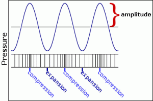

Amplitude, Intensity, and Loudness
==================================

Sound is variation in air pressure detectable by the human ear. It is a wave characterized by the transmission of energy in the form of compression (increased pressure) and rarefaction (decreased pressure) through a medium. Sound travels as a longitudinal wave, in which particles move back and forth along the line of the traveling wave. *Amplitude* is a wave's maximum variation in air pressure (from normal atmospheric pressure).

[https://dosits.org/tutorials/science/tutorial-intensity/](https://dosits.org/tutorials/science/tutorial-intensity/)  

<<<<<<< HEAD
The relationship between the objectively measured amplitude of a sound and our subjective impression of its loudness is very complicated and depends on many factors. Without trying to explain all of those factors, we can at least point out that our sense of the relative loudness of two sounds is related to the ratio of their intensities, rather than the mathematical difference in their intensities. For example, on an arbitrary scale of measurement, the relationship between a sound of amplitude 1 and a sound of amplitude 0.5 is the same to us as the relationship between a sound of amplitude 0.25 and a sound of amplitude 0.125. The subtractive difference between amplitudes is 0.5 in the first case and 0.125 in the second case, but what concerns us perceptually is the ratio, which is 2:1 in both cases.

Does a sound with twice as great an amplitude sound twice as loud to us? In general, the answer is "no". First of all, our subjective sense of "loudness" is not directly proportional to amplitude. Experiments find that for most listeners, the (extremely subjective) sensation of a sound being "twice as loud" requires a much greater than twofold increase in amplitude. Furthermore, our sense of loudness varies considerably depending on the frequency of the sounds being considered. We're much more sensitive to frequencies in the range from about 300 Hz to 7,000 Hz than we are to frequencies outside that range. (This might possibly be due evolutionarily to the importance of hearing speech and many other important sounds which lie mostly in that frequency range.)

Nevertheless, there is a correlation—even if not perfectly linear—between amplitude and loudness, so it's certainly informative to know the relative amplitude of two sounds. As mentioned earlier, the softest sound we can hear has about one millionth the amplitude of the loudest sound we can bear. Rather than discuss amplitude using such a wide range of numbers from 0 to 1,000,000, it is more common to compare amplitudes on a logarithmic scale.
=======
The amplitude of a wave is related to the amount of energy it carries. A wave with high amplitude carries more energy than a wave with low amplitude. The average amount of energy passing through a unit area per unit of time in a specified direction is called *intensity*.

The amount of energy per unit time is power, and intensity is therefore the amount of power transmitted through a unit area in a specified direction. Power is measured in watts, and intensity is therefore measured in watts per square meter. Scientists often specify sound intensity as a ratio, however. The sound intensity level, I, in decibels is defined as 10 times the logarithm of the ratio of the intensity of a sound wave to a reference intensity.
>>>>>>> 0deba09bfd4e34a0471f801f11e90e549ee3d0ec

The ratio between two amplitudes is commonly discussed in terms of *decibels* (abbreviated dB). A level expressed in terms of decibels is a statement of a ratio relationship between two values—not an absolute measurement. If we consider one amplitude as a reference which we call *A0*, then the relative amplitude of another sound in decibels can be calculated with the equation:

*level in decibels = 20 log10 (A/A0)*

If we consider the maximum possible amplitude as a reference with a numerical value of 1, then a sound with amplitude 0.5 has 1/2 the amplitude (equal to 10 to the -0.3 power) so its level is

*20 log10 (0.5/1) = 20 (-0.3) = -6 dB*

Each halving of amplitude is a difference of about -6 dB; each doubling of amplitude is an increase of about 6 dB. So, if one amplitude is 48 dB greater than another, one can estimate that it's about 2 to the 8th power (256) times as great.

Vocabulary
==========
- amplitude
- intensity
- loudness
- decibels

Additional Resources
=====================
- [A Level Physics - Wave Amplitude and Intensity](https://www.youtube.com/watch?v=dV7WqWIMl0o)
- [Khan Academy - Decibel Scale](https://www.youtube.com/watch?v=_p-WyPg1sbU)
