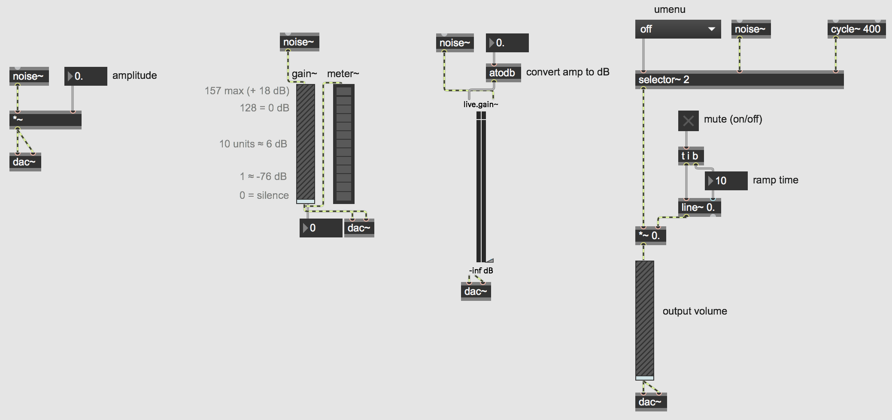

Examples of User Interfaces in Max
==================================

Open the Max patch named "BasicUI"

When designing a user interface in a musical context it is most important to strike a balance between intuitive and easy-to-use while maintaining a high degree of control over the program. The user should see only what they need to see and be able to quickly and easily change parameters within the program. When appropriate, the program should also have some sort of visual feedback to provide the user with meaningful information.

This basic Max patch only displays 7 objects with a few comments. There are no instructions or detailed explanations about how to use the patch, or really what it even does. Let's explore a bit and see what happens.

Clearly, this patch generates random notes within a given range and the user has the ability to change 1) the range of the notes, 2) the overall velocity (volume) 3) the speed, and 4) the instrument. The patch also provides the user with the notes as they would appear on both a standard keyboard and grand staff.

Let's take a look under the hood to see how this patch works. In Max, there are two basic viewing modes, patching and presentation mode. Clicking the small easel icon in the lower left-hand corner will toggle between these two views. You can think of these two different views as "editing" and "performance" modes. They don't actually change anything functionally within your patch, they simply allow you to display different objects for the user.

In patching mode, we see there are in fact more objects at work and they are not laid out in perhaps the same intuitive fashion. If you unlock the patch you might notice that some objects have a faint red hue or outline, these objects are the ones that have been selected to display in presentation view.  You can add/remove objects or comments from the presentation view by right-clicking and selecting "Add to..." or "Remove from Presentation".

 This patch makes use of commonly used GUIs in Max including **toggle**, **dial**, **slider**, **rslider**, **nslider**, **kslider**, and **radiogroup**.

In addition to the built-in Max GUI objects like **slider**, **dial**, **button**, etc. there are also some useful native MSP objects for creating a user interface. Perhaps the most common and most important feature nearly all audio programs have is volume control.

Open the Max patch named "BasicUI2"

Because MSP objects output their signal at full amplitude, we will need to attenuate (reduce or lower) the signal. The easiest way to do this is simply multiply the output by some number between 0 and 1.

This patch contains a few examples of useful MSP GUIs for controlling audio, specifically volume and amplitude. (Remember to turn on your DAC in the lower righthand corner to start MSP audio!)

The first section of code in the top left corner shows perhaps the easiest way to control the amplitude of a sound. Clicking and dragging on the *float box* will increase and decrease the output amplitude of the *noise~* object. Remember however, we do not hear amplitude linearly, so representing how loud something is as a number such as "0.257" may not give us useful or intuitive information. Additionally, doubling a sound's amplitude will generally not make it twice as loud, so interacting with the object may be difficult in a performance context for example.

The other sections of code show various GUIs that are useful in both visually representing and controlling a sound's volume in a musical or performative context. Adjust the sliders on the *gain~* and *live.gain~* objects. Notice how dB is a more intuitive representation of how loud the output is in relation to how we actually hear it. The *gain~* object is useful when interfacing with MIDI controllers, as it conveniently works with 0 (silence) to 127 (0dB) values. On the other hand, the *live.gain~* object has the slider and visual meter built-in to one.

How you represent your code and decide what is useful or relevant data is ultimately up to you.
