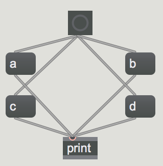
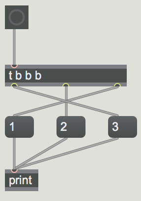
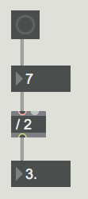

Introduction to Max and MSP
===========================

[Max](https://en.wikipedia.org/wiki/Max_(software) (previously referred to as Max/MSP/Jitter) is a visual programming language developed by [Cycling '74](https://cycling74.com/). It has become one of the most prominent coding environments for experimental musicians, composers, and visual artists over the last 20 years. Unlike traditional text-based languages, Max relies on graphically manipulating a modular system of objects connected by patch cords in a virtual blank canvas called a patcher (i.e. a "Max patch"). Objects are like pre-built self-contained programs and are used like dynamically linked libraries. Objects have inlets and outlets for input and output of data.

The program Max is actually a couple of programs under the hood. The "Max" part of Max (named after [Max Matthews](https://en.wikipedia.org/wiki/Max_Mathews), a pioneer of early computer music) deals with event scheduling and uses the data types *int*, *float*, *list*, *symbol*, and *bang*. "MSP" (short for Max Signal Processing and a tip of the hat to [Miller S. Puckette](https://en.wikipedia.org/wiki/Miller_Puckette)) deals with digital signal processing (DSP) and audio rate signals. "Jitter" deals with more complex matrix data structures and is used for experimental video processing (and other creative implementations). This course will predominantly focus on using Max and MSP.

Max comes with a number of well-documented and thorough tutorials to help familiarize yourself with the language and some of the quirks of the environment. You can access the Documentation page by clicking Help --> Reference in the top toolbar. Click on the Max tutorials sections and complete the first 6 tutorials (from "Hello" to "Simple Math in Max").

To test your ability and ensure that you've mastered the basic concepts from those tutorials, be sure you are able to answer all the questions in the self-quiz section below.

Self-Quiz
=========
-  In what order will the messages 'a', 'b','c', and 'd' print in the Max Console when the button is pressed? Why?

- In what order will the messages '1','2', and '3' print in the Max Console when the button is pressed? Why?

- Why does the following mathematical operation output an incorrect answer?

- Why is this a bad idea?

