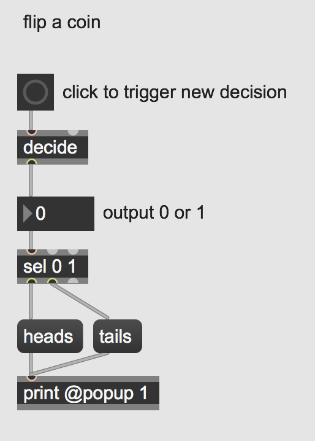
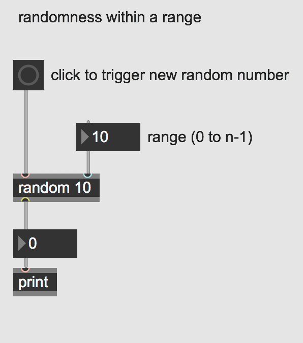
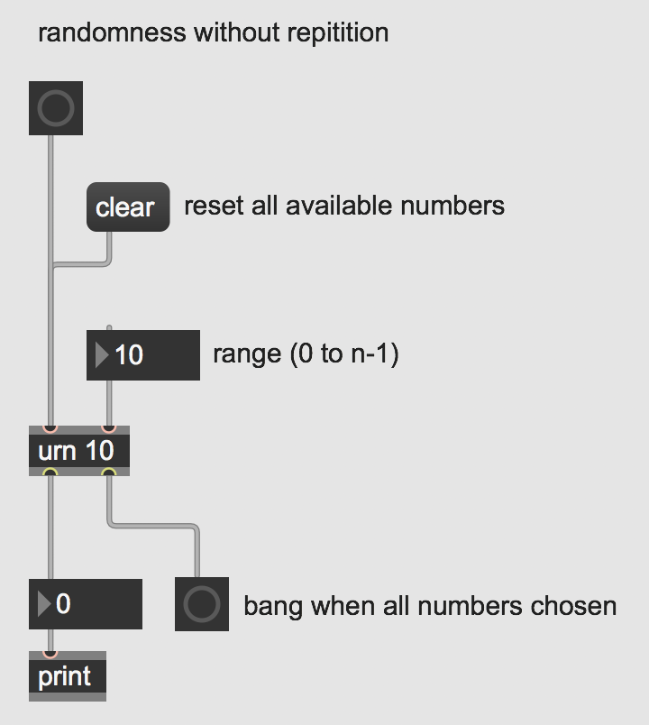
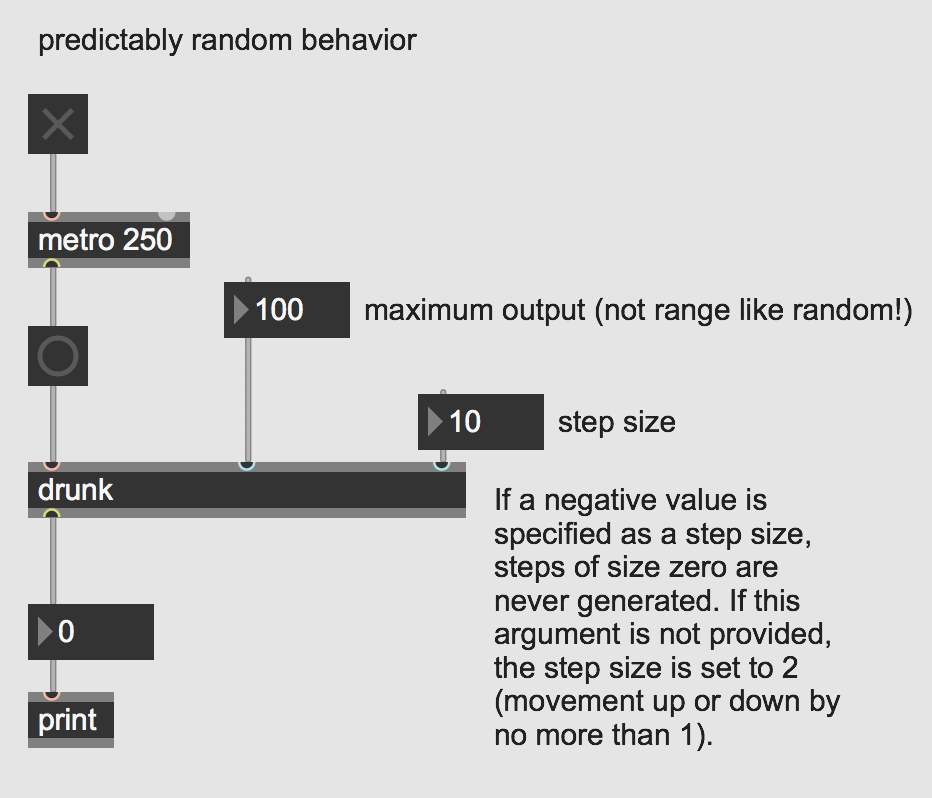

Randomness in Max
=================

One thing computers do much better than humans is generate "random" patterns. Though technically these aren't "random" in the ["truest" sense of the word](https://en.wikipedia.org/wiki/Random_number_generation#%22True%22_vs._pseudo-random_numbers), they are sufficiently random patterns for human perception.

Especially in the context of music, humans will always subconsciously rely on patterns and our past knowledge to create. Computer programs can be used to assist in the creative process and generate new ideas and have been used quite extensively since the 1950s in the field of [computer music](https://en.wikipedia.org/wiki/Computer_music#History) and [algorithmic composition](https://en.wikipedia.org/wiki/Algorithmic_composition).

Open the patch "Types of Random".

Max has several objects that are especially useful tools for generating different types of randomness: **decide**, **random**, **urn**, and **drunk**.

The object **decide** outputs random 0s or 1s when it receives a *bang*. This is like flipping a coin, you have a 50% chance of getting either a 1 or 0 each time a *bang* is sent.

The object **random** will output random numbers within a range. The range is from 0 to 1 less than the maximum argument specified. In other words, a range of 10 will output 10 numbers from 0 to 9 equally weighted. This object is like having a bag of differently colored marbles and after each time you reach in and take a new marble, you put that marble back into the bag (i.e. randomness with repetition).

You can generate randomness without repetition by using **urn**. This object will generate random numbers within a range (just like random) but will keep track of the output and prevent repetitions from occurring. When all available numbers within the range have been generated it will output a *bang* indicating there are no more different numbers to generate. This is like having a bag of marbles but each time you take one out, you leave it out and continue to draw from the smaller set of marbles left in the bag until there are no more marbles. The **urn** object also requires that you send it a *clear* message to reset (or "refill") your range once it is empty.

Last, **drunk** provides a kind of predictably random number generation by outputting a range of numbers with a step size. That means that it will generate a random number within a range, keep track of that number, and then output a new random number that is both within the range and the maximum step size of the last number generated. It's kind of like imagining a drunk walk back home from the bar: you know you need to get from A to B but the exact path along the way is a little random and wanders a bit.

## Downloads

Download the files used in the above examples by right-clicking the links, and
then selecting "Save Link As...".

* [Types of Random.maxpat](Types of Random.maxpat)

Assignment
==========
- Familiarize yourself with these objects and then open the examples subpatcher that contains musical applications of the different kinds of randomness.

- Combine all four types of randomness so they work together in a single patch. Consider that you can use them to decide how often notes are triggered, which notes are triggered (i.e. pitches), how long they last, how loud they are etc. You can also have nested randomness: experiment with having the ranges or step sizes randomly change.
