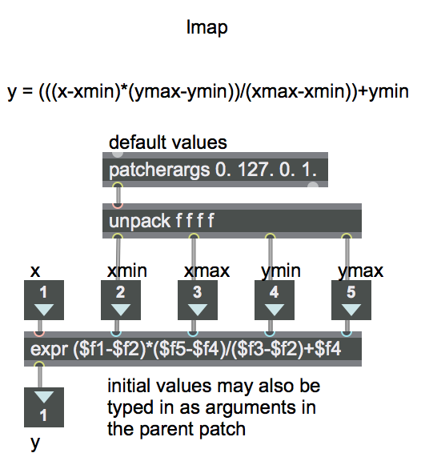

Linear Mapping Equation
=======================
Open the patch "lmap"

The term "mapping" refers to making a map of correspondences between a "source" domain and some other "target" range. The simplest kind of numerical mapping is called "linear mapping". That's when a one-to-one correspondence is drawn from every value in a source range X to a value that holds an exactly comparable position in a target range Y. For example, in the target range 0 to 100, the value 20 holds exactly the same position as the value 2 does in the source range 0 to 10. In both cases, the value is 20% of the distance from the minimum to the maximum.

To convert one range into another linearly, there are really just two simple operations required: scaling (multiplication, to resize the range) and offsetting (addition, to push the range up or down). If you know the extent of two ranges X and Y, and a source value x, you can find the linearly corresponding target y value with this algebraic equation:


**y = (((x-xmin)*(ymax-ymin))/(xmax-xmin))+ymin**

This patch uses the **expr** object to implement that equation. In **expr**, the items such as ***$f1*** and ***$f2*** mean "the (floating point) number that has come in the first inlet", "the (floating point) number that has come in the second inlet", and so on. (Geeky technical note: We don't need to use quite as many parentheses in the **expr** object as we did in the equation above, because the ordering of mathematical operations is implicit, due to the [operator precedence](https://en.wikipedia.org/wiki/Order_of_operations) that is standard in almost all programming languages.)

This patch has **inlet** objects and an **outlet** object so that it can be used as an object in another patch. You just save this patch with the name "lmap" somewhere in Max's file search path, and you can then use it as a **lmap** object in any other patch. You establish the X and Y ranges by specifying their minimum and maximum (xmin, xmax, ymin, and ymax), then you send an x value in the left inlet to get the corresponding y value out the outlet. The **patcherargs** object supplies default initial values for xmin, xmax, ymin, and ymax in case no arguments are typed into the object when it's created in the parent patch; however, if values are typed in for xmin, xmax, ymin, and ymax (as in **lmap 0. 1. -2. 2.**), the **patcherargs** object inside **lmap** will send those values out instead of its default values.

Go ahead and download that patch and save it with the name "lmap", as it will be used in other examples. In Max, patches that are saved with a one-word filename and used as objects in another patch are called "abstractions". This **lmap** abstraction functions very much like the **zmap** object and **scale** object that already exist in Max, but we've provided **lmap** here so that you can see how one might implement the basic linear mapping function (in any language).

Vocabulary
==========
- mapping
- linear mapping
- source domain
- target domain
- scaling
- offsetting
- linear mapping equation

Max Objects
===========
- **expr**
- **lmap** (an abstraction not native to Max)
- **inlet**
- **outlet**
- **patcherargs**
