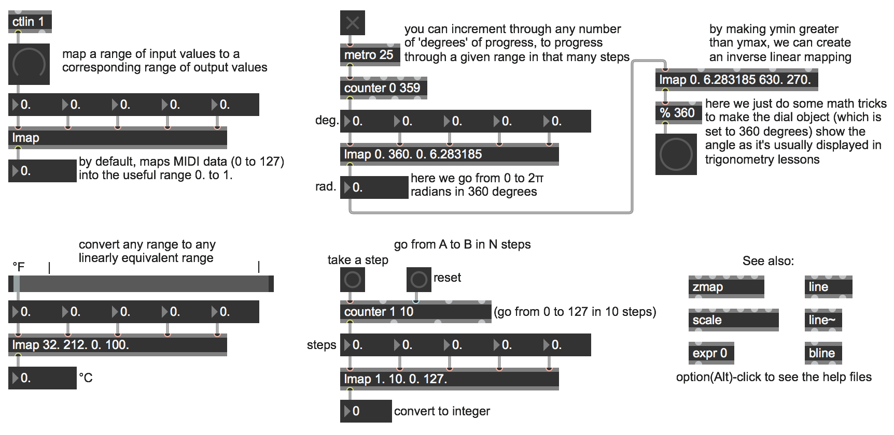

Linear Mapping and Interpolation
================================
Open the patch "linearmapping".

This patch shows examples of linear mapping and linear interpolation. First, be sure you have downloaded the **lmap** abstraction from part 1 of this module. One could substitute the built-in Max object scale in place of **lmap** with the same results.

As shown in the upper-left corner, with no arguments typed in **lmap** maps input values 0 to 127 (such as MIDI control data) into the range 0.0 to 1.0 (just as the **scale** object does by default). The output range 0.0 to 1.0 is useful for controlling the parameters of a lot of MSP objects, and it's also a range that can be re-mapped to any other range with simple scaling and/or offsetting (multiplication and/or addition). If we open up the **lamp** abstraction, we see that inlets 2 and 3 correspond to our input low and high values while inlets 4 and 5 are our target output values.

Just below that is a mundane example of how linear mapping applies to common everyday conversion, such as converting temperatures from Fahrenheit to Celcius.

You can use linear mapping to step through any range in a specific number of N steps, just by setting an input range from 1 to N and providing input x values that count from 1 to N. This is demonstrated by the part of the patch labeled "go from A to B in N steps”. In effect, this is linear interpolation from A to B, since each step along the way will produce a corresponding intermediate value.

The part of the patch just above that demonstrates we have another case of the relationship between "mapping" and "interpolation". The **counter** object counts cyclically in 360 steps from 0 to 359 (i.e., from 0 to almost 360), and we map the range 0 to 360 (the number of degrees in a circle) onto the output range 0 to 2π (the number of radians in a circle). Thus we're able to go continually from 0 to (almost) 2π by degrees. (We then map that value with an inverse relationship in order to cause the **dial** to show the radial angle changing counterclockwise as it would be graphed in Cartesian trigonometry. Setting ymin to be greater than ymax causes such an opposite mapping.)

You’ll also want to check out these objects: **zmap**, **scale**, and **expr**. In addition, the Max objects **line**, **line~**, and **bline** offer three methods for linear interpolation within a single object.

Vocabulary
==========
- mapping
- interpolation

Max Objects
===========
- **lmap**
- **scale**
- **counter**
- **dial**

Additional Resources
====================
- [Linear Interpolation Wikipedia](https://en.wikipedia.org/wiki/Linear_interpolation)
- [Linear Control Function](http://sites.uci.edu/camp2014/2014/04/18/linear-control-function/)
