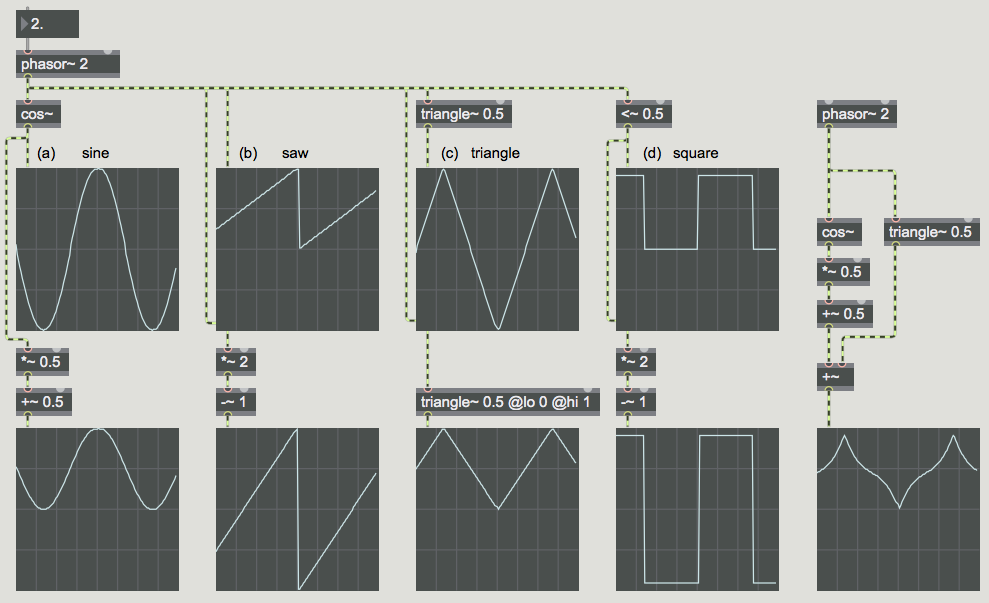

Classic Waveforms as LFOs
=========================

An [oscillator](https://en.wikipedia.org/wiki/Electronic_oscillator), in terms of analog electronics, is a circuit that produces a periodic waveform. When the frequency of a an oscillator is within the [range of human hearing](https://en.wikipedia.org/wiki/Hearing_range) (~20Hz-20kHz) we call that "audio rate" because we can hear it. When the frequency of an oscillator is below our range of hearing (<20Hz) they are referred to as low-frequency oscillators or LFOs. Instead of "making sound" these types of oscillators are used as "control signals." In other words, their output is mapped to some other parameter of another oscillator or effect you may want to automatically control or change.

There are certain wave types that are historically used in electronic music, known as "classic" waveforms: sine, sawtooth, square, and triangle. These are the four waveforms generated by the classic Moog synthesizer oscillators, and are still quite useful in computer music.

The sine wave has energy at only one frequency. The sawtooth wave has energy at all harmonics of the fundamental frequency, and the relative amplitude of each harmonic is proportional to the inverse of the harmonic number, e.g., 1/1, 1/2, 1/3, 1/4, etc. The square wave has energy only at the odd harmonics of the fundamental frequency, and the relative amplitude of each harmonic is proportional to the inverse of the harmonic number, e.g., 1/1, 1/3, 1/5, 1/7, etc. The triangle wave has energy only at the odd harmonics of the fundamental frequency, and the relative amplitude of each harmonic is proportional to the inverse of the square of the harmonic number, e.g., 1/1, 1/9, 1/25, 1/49, etc.

This patch shows how to synthesize those classic waveforms in Max. A very important object for doing this is **phasor~**. The **phasor~** object produces a signal that goes from 0 to (almost!) 1 over and over at a specified rate. (When it gets to a point that would be 1 or more, it wraps back around into the 0-to-0.999999 range.) Thus, with just a little arithmetic, it's very useful for reading through a **buffer~** of stored data or for generating other control signal shapes.

In this patch, a single **phasor~** is used to a) control the phase offset of a 0 Hz **cycle~**, which essentially means that it's reading through a stored wavetable containing the shape of one cycle of a cosine wave, b) make an idealized sawtooth waveform (which is what it does all by itself), c) make a triangle wave by going up to, and folding back down from, its maximum at a designated point in each cycle, and d) make an idealized square wave with a simple logic operator that sends out either 1 or 0 based on the specified condition. We're using an inaudible frequency of 2 Hz for the **phasor~** so that the waveforms will be displayed well in the **scope~** objects.

With just a little more arithmetic (usually just one multiplication and one addition) you can adjust the range of these shapes to be any size you want, as shown in the middle row of graphs. Thus, you could use these shapes to control anything you want, such as frequency in Hertz, for example.

Although these waveforms are fine to use as control signals, they're not always the best choice to actually listen to. That's because the ideal sawtooth, square, and triangle waveforms have a theoretically infinite number of harmonic partials. If we listen to them at fairly high fundamental frequencies, the upper partials are likely to be folded back over due to aliasing, creating an inharmonic spectrum. For that reason, if you actually want to listen to those waveforms, it's better to use the **saw~**, **tri~**, and **rect~** objects. They use special formulae to calculate a waveform that will have essentially the right spectral content up to the [Nyquist frequency](https://en.wikipedia.org/wiki/Nyquist_frequency), but will not produce significant energy at frequencies that exceed the Nyquist frequency. They don't have the same shape as the ideal forms of those wave types, but they sound the same and aren't subject to aliasing. Use those for listening, and use the idealized waveforms for control signals.

Vocabulary
==========
- oscillator
- LFO
- sine wave
- sawtooth wave
- square wave
- triangle wave
