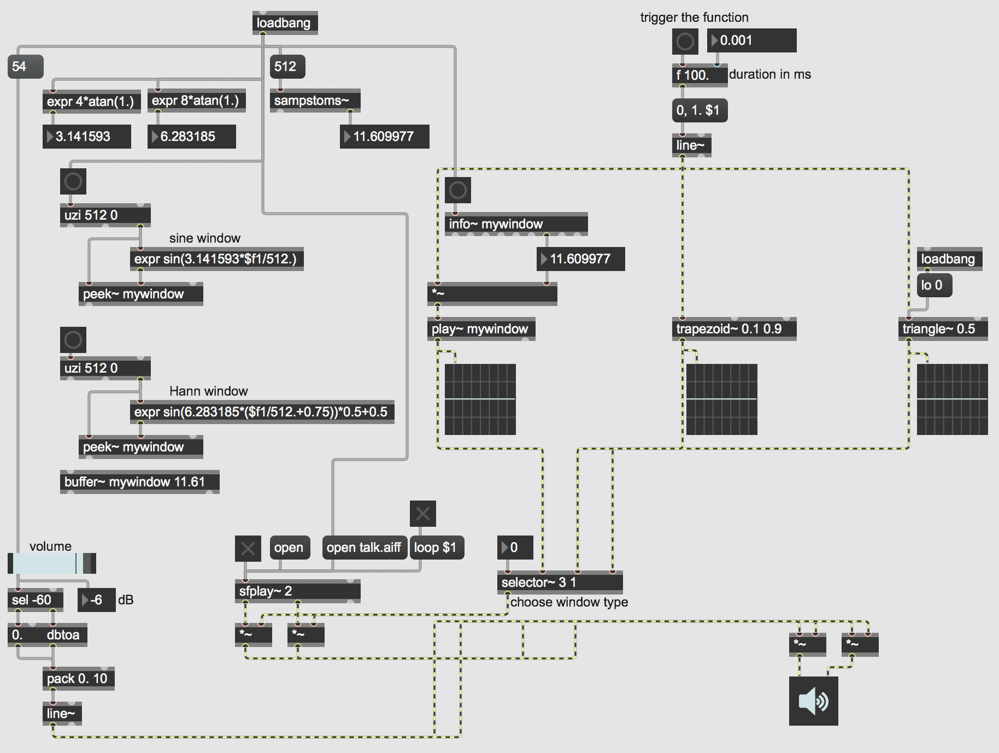

Advanced Windowing of an Audio Signal
=====================================

Open the patch "Advanced Windowing".

In signal processing, a "window" is a function (shape) that is nonzero for some period of time, and zero before and after that period. When multiplied by another signal, it produces an output of 0 except during the nonzero portion of the window, when it exposes the other signal. The simplest example is a rectangular window, which is 0, then briefly is 1, then reverts to 0. The windowed signal will be audible only when it is being multiplied by 1––i.e., during the time when the rectangular windowing occurs. Many other window shapes are possible: trapezoidal, triangular, a "sine" window (the first half of a sine wave), etc.

Windowing is most often used in spectral analysis, to view a short time segment of a longer signal and analyze its frequency content. Windows are also used to create short sound segments of a few milliseconds' duration called "grains", which can be combined into granular sound clouds for unique sorts of synthesis. In general, one can think of any finite sound that has a starting point and a stopping point as being a windowed segment in time. For example, a **cycle~** object is always producing a signal, but we can window it with a ** *~ ** object, keeping its amplitude at 0 except when we want to hear it. However, a rectangular window––suddenly switching from 0 to 1 and then back from 1 to 0––will usually create a click, so other window shapes are usually more desirable.

This patch shows several ways to create a window function in MSP. To read through the function, you need some sort of linear signal such as **line~**, **phasor~**, **count~**, or the right outlet of **groove~**. The MSP objects **trapezoid~** and **triangle~** can convert a linear 0-to-1 signal into various sorts of trapezoidal or triangular functions. You can also use a math expression to calculate some other function arithmetically; you can either do that on the fly or, more economically, do it in advance, store the result in a memory buffer, then read through the buffer whenever you need that window shape. That last method is what's being done with the **buffer~**, **peek~**, and **play~** objects.

In the top left part of the patch, we see some ways to obtain useful constants for mathematical computations. For example, *pi* and *2pi* are numbers that are often needed for computing a cyclic waveform (or a part of one). Once you know the constant value you need, you can plug it into your own math expression. The **sampstoms~** object is useful for figuring out how many milliseconds correspond to a certain number of audio samples. (And the reverse calculation can be made using its counterpart **mstosamps~**.) In this case, we learn that 512 samples at a sampling rate of 44,1000 Hz is equal to 11.61 milliseconds, so we create a **buffer~** of exactly that length. Then we use **uzi**, **expr**, and **peek~** to quickly fill that buffer with 512 samples describing half of a sine wave, which will be our window shape. (Double-click on the **buffer~** to see its contents.) The formula for another common window shape, known as a Hann window, is also shown just below that.

Then, you can play a sound file with **sfplay~**, choose one of the three window functions with the **selector~** (the sine window is initially chosen by default), and trigger a window to occur by clicking on the button at the top of the patch.

This sort of windowing technique is useful for shaping the amplitude envelope of sampled sounds or any other audio signals, in order to avoid clicks and to create the sort of attack and release characteristics you want for a sound, whether it be a short grain or a longer excerpt.
