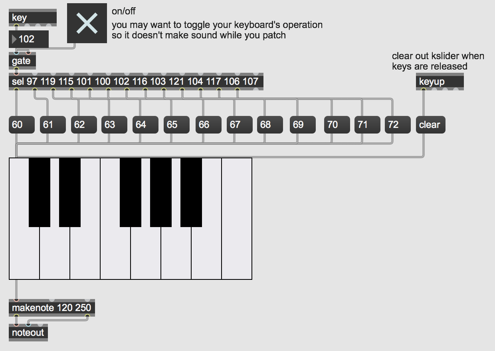

# Keyboard Input in Max

You may want to use your computer's typing keyboard as a built-in hardware interface to interact with your Max patch. This could allow you to easily build musical keyboards, advance automations or patch states, or start/stop various processes. Your computer already understands and encodes this kind of interaction as [ASCII data](https://en.wikipedia.org/wiki/ASCII).

Open the patch "Keyboard Input".

The first part of this patch demonstrates the simplest way to get your keyboard data into Max. We simply need to use the **key** object to output the relevant ASCII data when a key pressed on your keyboard. The **keyup** object lets us know when a key is released. By using the **select** object (this object is commonly abbreviated as **sel**) we can tell Max to look for certain keys and send out a bang when those keys are pressed or released.

The second part of this patch shows one particular musical application of using your computer's keyboard as a musical keyboard. Here we use the key object to look for the home keys as white keys and the "w,e,t,y,u" keys as the black keys. We then send out bangs to MIDI messages to assign each key to a chromatic note on the keyboard.

In this example, pressing these keys will result in sound. This could potentially be quite annoying if you are either still editing your patch or want to use your keyboard for any other reason. So, one easy way to solve this is to add in a **gate** object after the **key** object so that you can toggle your keyboard's operation.

## Downloads

Download the files used in the above examples by right-clicking the links, and
then selecting "Save Link As...".

* [Keyboard Input.maxpat](Keyboard Input.maxpat)
