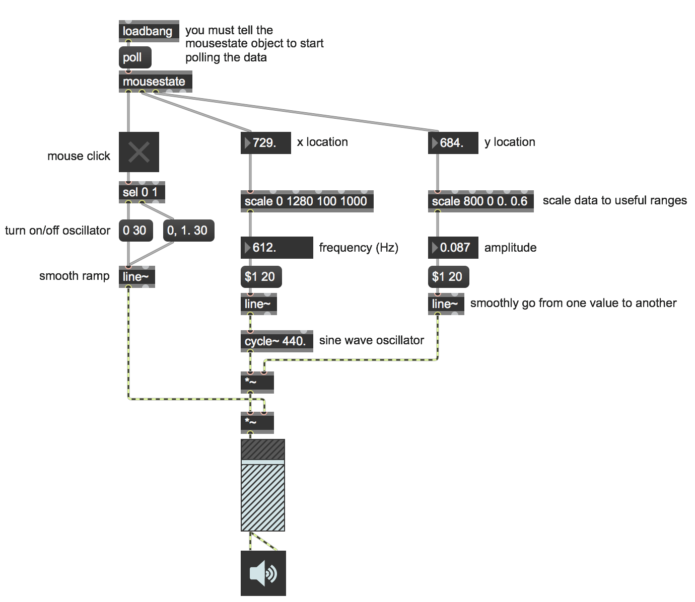

# Mouse Input in Max

You may want to use your computer's mouse data as a way to interact with your Max patch. This can allow you to easily create more gestural kinds of interaction with your computer's built-in hardware.

Open the patch "Mouse Input".

Getting the mouse data into Max is incredibly simple. The object **mousestate** generates lots of useful data such as whether or not the mouse is clicked, its XY location on your screen (your screen resolution will change this!), and also XY delta information.

This patch demonstrates how to make a simple mouse [theremin](https://en.wikipedia.org/wiki/Theremin). Clicking (and holding) the mouse will turn on the sine wave oscillator's output and moving the mouse will control both volume (vertical) and frequency/pitch (horizontal).

## Downloads

Download the files used in the above examples by right-clicking the links, and
then selecting "Save Link As...".

* [Mouse Input.maxpat](Mouse Input.maxpat)
