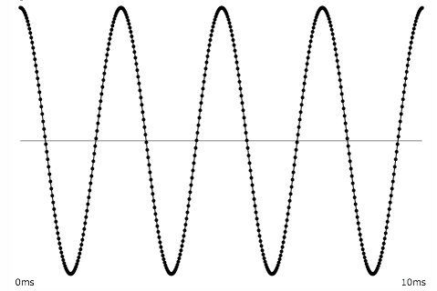
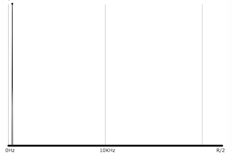
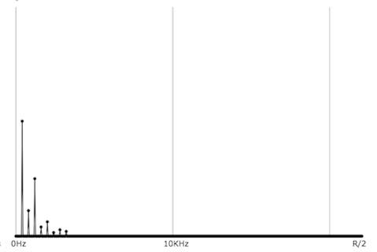
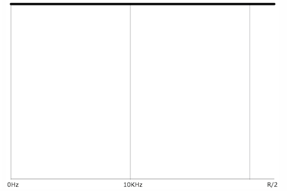
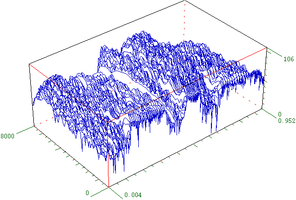
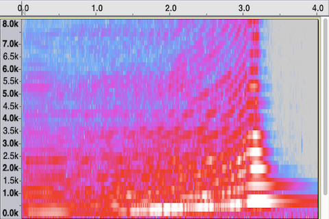

# Introduction to Filters

---

## What's a filter?

In everyday parlance, a filter is a device that allows some things to pass through while blocking other things. A coffee filter allows water to pass through without allowing the coffee grounds to pass through, an air filter blocks dust particles while letting the air through, and so on.

In computer programming, a filter is any program that converts its input into a different output. To be a little more specific, a filter modifies its input in some predictable way, without transforming it into something completely different, and outputs something that is in the same format as the input but that has been altered. For, example, if this sentence, up to the colon, were the input to a comma-removing filter, it would come out as: "For example if this sentence up to the colon were the input to a comma-removing filter it would come out as". The output is still a coherent string of characters, but it's comma-free.

In analog electronics, a filter is a circuit that allows some frequencies to pass through better than others, thus altering the frequency content of an electrical signal. The altering effect of such circuits can often be described mathematically using differential equations.

In the case of a signal that has been digitized, one can describe a digital filter using algebra instead of calculus, with what's called a "difference equation". For each sample of the input signal, we use the difference equation to calculate the corresponding output sample. A digital filter for modifying a signal consists of an arithmetic equation that uses the current input sample and some past samples as variables on one side of the equation, and has the output sample, the desired result, on the other side of the equation. We usually refer to the current input sample as _x(n)_, or sometimes _xn_, where _x_ means "input" and _n_ is the current sample number. The current output sample is _y(n)_. The previous input sample can thus be called _x(n-1)_, and the previous output sample _y(n-1)_. An example difference equation might look like _y(n)=0.5x(n)+0.5x(n-1)_. For each input sample _x(n)_, assuming we also  keep track of what the previous input sample _x(n-1)_ was, we can calculate the filter's output _y(n)_.

Digital signal processing (DSP) is a large and important topic in electrical engineering and audio engineering, and filter design is a major topic within DSP. Any signal that can be represented as a stream of numbers is subject to mathematical manipulation. Filtering is particularly important in digital audio, because it allows us to alter the frequency content of a signal. Altering the frequencies in an audio signal alters the perceived _timbre_ (tone color) of the sound.

---

## Timbre

Timbre refers to our subjective sense of the distinctive character of a sound, often referred to as its "tone color" or its "tone quality". Almost all sounds contain multiple many frequencies. The relative amplitudes of those frequencies, and the way that the frequencies and their amplitudes change over the course of the sound, give the sound its signature timbre. It's difficult to describe the timbre of a sound because timbre is dependent on the way that the relative amplitudes of all those many component frequencies change from instant to instant. People generally refer to timbre by placing it on some continuum. For example, one might refer to a sound that has a lot of energy at higher frequencies as "bright", as opposed to a "dull" or "dark" sound that lacks high frequency energy. Or one might refer to a relatively simple quasi-sinusoidal sound as a "pure" tone, as opposed to a "noisy" sound containing many unrelated frequencies. So, although we don't have a well-established vocabulary for precise discussion of timbres, it's clear that we tend to compare timbres in terms of their _spectrum_, their concentration of energy at different frequencies. Thus, a filter that alters the relative amplitudes of those frequencies will affect the sound's timbre.

___

## Viewing the spectrum

The most common way to visualize sound is as a graph of amplitude over time. Since the horizontal x axis of a graph is known as the _domain_, this is called a _time-domain_ view of the sound. Normally the time-domain view doesn't give us a whole lot of specific information about the frequency content of the sound, but there are a few exceptions. For example, if the sound is smooth and sinusoidal and repeats with a regular periodicity, we can know that the sound has energy at that frequency of repetition.

 
_This sinusoidal shape repeats four times in 1/100 sec., so it has energy at 400 Hz._

Even if the sound is not so smooth, but still essentially repeats, we can figure out its fundamental frequency and can surmise that it also has energy at whole-number multiples of that frequency.

 
_This shape repeats four times in 1/100 sec., so we can surmise that it has energy at whole-number multiples of 400 Hz._

As a rule, the smoother a time-domain signal, the less high-frequency energy it contains. Conversely, sharper angles in a time-domain graph indicate more high-frequency energy in the signal.

&nbsp;&nbsp; 
_A pure tone, and a tone with high-frequency energy_

For more specific information about the frequency content of a signal, it's useful to view a short segment of that signal in the _frequency domain_, as a graph of amplitude over frequency. In that case, we're treating that short amount of time as if it were a single instant, and examining the relative amplitudes of each frequency at that moment. Because this gives us a view of the sound's spectrum of frequencies, the frequency domain is sometimes also referred to as the _spectral domain_.

A sine tone has energy at only one frequency, while a more complex periodic tone has energy at frequencies that are whole-number multiples of a common fundamental frequency. A momentary impulse (a single click) produces equal energy at all frequencies. White noise (random samples with no correlation) similarly has equal average energy in all frequency regions.

&nbsp;&nbsp; 
_Cosine wave, energy at one frequency_

&nbsp;&nbsp; 
_Periodic complex tone, energy at whole-number multiples of a fundamental frequency_

&nbsp;&nbsp; 
_Momentary impulse, energy at all frequencies._

&nbsp;&nbsp; 
_White noise, energy at all frequencies._

It's worth noting that those 2D graphs of a sound's spectrum do not have an axis showing time. We're using a short segment of time and treating it as a single moment in time. It is possible, however, to show how a sound's spectrum changes over time, using a 3D graph to include time as one axis, or by using color to show intensity.

 
_A 3D plot of amplitude, frequency, and time_

In the following graph, time is the x axis, frequency is the y axis, and color is used to indicate amplitude of each frequency at each moment in time. The graph shows an apparently pitched (harmonic) sound increasing gradually in its fundamental frequency and its amplitude, arriving at its loudest and brightest moment at time 3.2 seconds, then quickly dying away, with the upper partials decaying more rapidly than the lowest ones.

 
_Frequency over time, with amplitude shown by color._

A graph of that same sound, showing amplitude over time, gives us similar information about the sound's change in amplitude over time, but omits any information about the frequency content of the sound (which, in musical terms, might be considered this sound's most important aspect).

<audio src="./cello4.mp3" controls style="width:480px;"></audio>

 
_Time-domain view, amplitude over time_

---

## Vocabulary

- filter
- digital filter
- timbre
- spectrum
- time domain
- frequency domain
- spectral domain
- sinusoidal tone
- complex periodic tone
- impulse
- white noise

---

## Self-Quiz

If you can see that a waveform repeats in the time domain, what can you expect to see in the frequency domain?
Harmonically-related frequencies (whole-number multiples of a fundamental frequency)

What musical characteristic will you hear in a repeating time-domain waveform?
A musical pitch, related to the tone's fundamental frequency

If a tone is "bright/buzzy/brassy" in timbre, what might you expect to see in the spectrum, compared with a "pure" sine tone?
Significant energy at higher frequencies than the fundamental frequency

What is the spectrum of white noise?
Equal average amplitude in all frequency regions

How can we visualize a spectrum changing over time?
Using a graph with 3 dimensions or color to show frequency, amplitude, and time

---

This page was last modified September 1, 2018 by Christopher Dobrian, <a href="mailto:dobrian@uci.edu">_dobrian@uci.edu_</a>.
