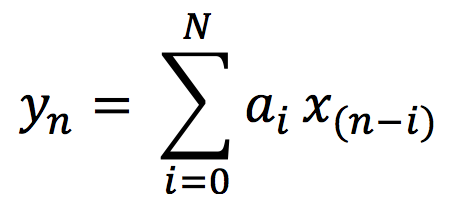

# Simple Lowpass Filter

---

## Introduction

A lowpass filter reduces the high-frequency content of a signal while allowing lower frequencies to pass through.

There are many reasons why one might want to attenuate or remove high frequencies. In the analog-to-digital conversion (ADC) process of digitizing an electrical signal, it's important to remove frequencies that are above the Nyquist frequency (i.e., that are above 1/2 the sampling rate) so that they wont be misrepresented in the digital signal. A lowpass filter used for that purpose is called an _anti-aliasing_ filter. In a digital signal received from a sensor (e.g., a motion detector), the data might be noisy and jittery or might contain occasional spurious incorrect values. A _smoothing_ lowpass filter can smooth out those inconsistencies. And in the case of an audio signal, a lowpass filter is often used to reduce high-frequency hiss in a recording, or to reduce the amplitude of upper frequencies in the sound itself, in order to change the sound's timbre.

In all cases, reducing high frequency content of a signal results in a slightly smoother-looking waveform in the time domain.

---

## The Simplest Lowpass Filter

Most lowpass filters smooth the input signal by taking a weighted combination of the current input sample and one or more previous samples, to calculate a weighted moving average. The simplest example of this would be a filter that outputs the average (mean) of the current input sample and the previous input sample. The difference equation for that lowpass filter would be:

_yn = (xn+xn-1)/2_

where _xn_ is the value of the current input sample, _xn-1_ is the previous input sample, and _yn_ is the current output sample.

This kind of averaging won't alter the input signal much at all if the signal is changing very gradually from one sample to the next, but it will smooth the signal considerably if the input changes drastically from sample to sample. Thus, high frequencies, which cause more rapid and radical change in the signal, get smoothed out a little, reducing the high-frequency energy.

In case that's not intuitively obvious to you, let's look at a couple of examples. If an input stream of numbers is 0. 0.1 0.2 0.4 0.5 0.3 0.1 0.&mdash;and we assume an initial _xn-1_ with a value of 0.&mdash;the output would be 0. 0.05 0.15 0.3 0.45 0.4 0.2 0.05, which has a progression and shape very similar to the input.

 
_A smooth input is only slightly smoothed by the lowpass filter_

Whereas, with a jagged input stream (containing high-frequency energy), a smoothing filter will have a more remarkable effect. With an input stream such as 0.8 0.7 -0.1 0.9 -0.9 0.1 -0.4 0.4, the output would be 0.4 0.75 0.3 0.4 0. -0.4 0.15 0., which is significantly different in shape and amplitude (especially of the jagged high-frequency edges) from the input.

 
_A jagged input is more noticeably smoothed by the lowpass filter_

Similarly, in audio signals, a sound without much high-frequency energy, such as the 1000 Hz sine tone shown below, is not much affected by this simple lowpass filter.

 
_A 1KHz sine tone almost totally unaffected by the lowpass filter_

Whereas a noise signal will show a more significant change because of the attenuation of its high frequencies.

 
_A noisy input is changed more by the lowpass filter_

Below, you can see the gently sloping amplitude response of this lowpass filter shown as a graph of amplitude over frequency.

 
_Effect of the lowpass filter yn = (xn+xn-1)/2_

---

## Adjustable Lowpass Filter

It's worth pointing out that the averaging filter described above is just one instance of a slightly more general filter that would allow any balance between the current input sample and the previous input sample. The averaging equation above could be restated equivalently as

_yn = 0.5xn+0.5xn-1_

and that's a particular case of the equation

_yn = axn+(1-a))xn-1_

in which the current input value is multiplied by a coefficent _a_ and the previous input value is multiplied by _(1-a)_. When the value of the coefficient _a_ is 1, there will be no change to the input (the delayed input sample will be multiplied by 0), whereas when the value of the coefficient _a_ is 0.5, _1-a_ will also equal 0.5, yielding the average of the most recent two input samples. Any value of _a_ between 1 and 0 will provide a different weighting between the two samples.

(It's worth noting that the filter's effect becomes strongest as _a_ approaches 0.5. As _a_ goes below 0.5 toward 0, the filter's effect becomes weaker until, when _a_ = 0, the output is the same as the input, just delayed by one sample.)

Interestingly, if we change the + operator to a - operator in the above equation,

_yn = axn-(1-a))xn-1_

or

_yn = axn+(a-1))xn-1_

the filter becomes a highpass filter.

 
_Effect of the highpass filter yn = (xn-xn-1)/2_

---

## Nth-order FIR Filter

In the simple lowpass filter formula shown above, the coefficient of the delayed sample is always one minus the coefficient of the current input sample. If we were to make the two coefficients independent of each other we could write a slightly more general equation,

_yn = a0xn+a1xn-1_

in which _a0_ and _a1_ could be any value (usually between -1 and 1). And, in fact, you could extrapolate from that an even more general equation that would provide a weighted sum of _any_ number of immediately preceding samples,

_yn = a0xn+a1xn-1+a2xn-2+ ... aNxn-N_

Another way of writing that same formula is in the form of what's called summation notation or sigma notation.

 
_FIR filter equation in sigma notation_

The ordered set of coefficients in this equation is called its _impulse response_. In digital audio, the term impulse is used to refer to a single sample of value 1 (surrounded by 0s before and after it). If you were to feed an audio signal consisting of a 1 followed by N 0s in to this equation (and assume that all the prior samples had been 0s, as well), the output result would be a signal equal to the impulse response, the coefficients of the equation. The equation above describes what's called a finite impulse response (FIR) filter. For any finite signal that's put into it, the resulting output will also be finite, eventually returning to 0 N samples later. A filter equation consisting of the input sample plus N previous input samples is called an Nth-order FIR filter.

An FIR filter in which all the coefficients are between -1 and 1 will only result in attenuation (reduction of amplitude) of the signal at certain frequencies. It will not resonate (increase) the energy at any frequency.
