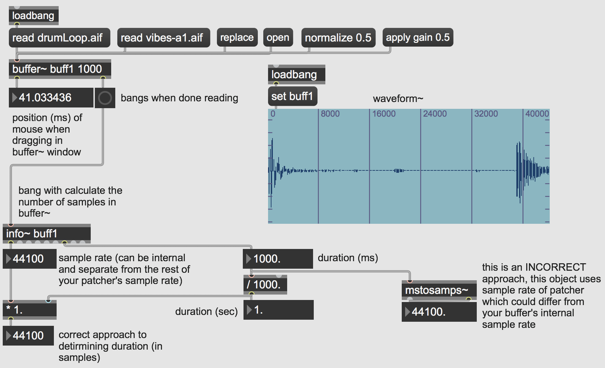

# Getting Info From a Buffer

Open the patch 'bufferinfo'

This patch doesn't play any audio, but it does allow us to access some useful information related to the audio data stored within our **buffer~** object.

First, it is important to consider the arguments related to the **buffer~** object. All **buffer~** objects *must* be named so that they can be referred to by other objects for both playback and information. In this case, the buffer is labeled 'buff1'. The next argument is the length of the buffer in milliseconds, in this case it is one second long (or 44100 samples). Additional arguments could include the number of channels––if using stereo or multichannel audio––or specifying a default file to load into the buffer.

In the latter case, we can load a default file into the **buffer~** by using the *read* message followed by the specified file name (remember that you must take into account where these files are stored on your computer and project file paths).

If arguments are absent, when you load in a sound from a file with the *read* message the **buffer~** will be resized to hold the entire file. The *replace* message is like *read* except that it will always resize the **buffer~** regardless of the arguments. 

If I click these messages, it will load those files into the buffer and we will see the related objects and information change (and you should also notice that a bang has been sent out of the **buffer~**'s right inlet). You can also use the *replace* message to load in any other file stored on your computer into the buffer.

If you want to view the contents currently stored in a buffer you can either use the *open* message or double-click on the **buffer~** object itself. Clicking and dragging, using your mouse, will display as a position in milliseconds out the **buffer~**'s left inlet. This can be useful if you want to determine playback cues for example.

Another way to visualize the contents of a **buffer~** object is to use the **waveform~** object. This object––like all objects related to **buffer~**––requires that you identify and label which buffer it should refer to. In this case, we use the the *set* message followed by our buffer's name, 'buff1'. Changing the buffer will automatically change the display in the **waveform~** object.

There are two other messages worth noting that can alter the contents of a buffer. The *normalize* message and the *apply gain* message will change the amplitude (i.e. volume) of the sound file within a buffer. Normalizing will calculate the maximum peak amplitude of a file and adjust the entire file so that it's peak amplitude matches the argument in the *normalize* message (i.e. this will raise or lower the entire file so that the peak amplitude matches the argument of the *normalize* message). This approach is useful when you are dealing with a number of different sound files that may have varying amplitudes and you want them to each peak at the same maximum amplitude. Another useful message is *apply gain*. This message will alter the entire amplitude of the file loaded into a buffer on each successive sending of the message. So, each time I click the '*apply gain 0.5*' message it will reduce the amplitude by 50%. This operation can also be undone using the *normalize* message again.

## Downloads

Download the files used in the above examples by right-clicking the links, and
then selecting "Save Link As...".

* [bufferinfo.maxpat](bufferinfo.maxpat)
