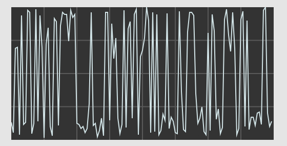
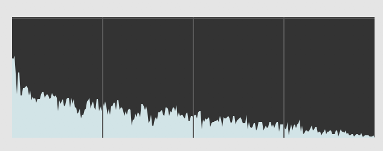

# Getting to the Frequency Domain: In Theory

### What Is Timbre?

A trumpet plays middle C.  A violin plays middle C.  They are playing the same
note, yet why do they sound different?  The answer is that these two instruments
have different **timbres**.  (Prounounced "TAM-ber", not "TIM-ber" or
"TIM-bruh".)

As discussed in the [Physics of
Sound](https://dobrian.github.io/cmp/topics/physics-of-sound/0.index.html)
topic, every pitch is composed of multiple sine waves.  The lowest sine wave is
called the "fundamental frequency"; for middle C, (aka C4) this is around
261.63 Hz.  The higher sine waves are all at integer multiples of the
fundamental frequency: the first overtone is 261.63 x 2 = 523.26 Hz (aka C5),
the second overtone is 261.63 x 3 = 784.89 Hz (aka G5), and so on to infinity.

The reason why the trumpet and the violin sound different has everything to do
with these overtones.  *An pitch's timbre is entirely determined by the
relative loudnesses (aka amplitudes) of the sine waves that compose it.*  So,
one might imagine that for one instrument, the 2nd, 4th, and 7th overtones are
particularly loud, while for another instrument, the 3rd, 4th, and 11th
overtones are particularly loud, and so the two instruments would end up
sounding quite different.

But how do we know exactly which overtones are loud, and which ones are not?
The answer can be found by visualizing the sound in the frequency domain.

### The Frequency Domain

Normally, we look at sounds in the time domain: amplitude on the y axis, and
time on the x axis.  We line up a bunch of samples on the x axis, graph their
amplitudes, and the result looks something like this:

<caption>A sound represented in the time domain.</caption>

In the frequency domain, the picture is different.  On the x axis, we have what
are called "frequency bins".  These are evenly-spaced frequencies, with 0 Hz on
the leftmost side of the graph, and a hair under 44100 Hz (or whatever the
sampling rate is) on the rightmost side of the graph.  Unlike the time
domain—in which the x axis can theoretically stretch to infinity—the frequency
domain is bounded by 0 Hz on the left and (a bit less than) the sampling rate
on the right.  On the y axis, we have the relative magnitude at that frequency.
Unlike in the time domain, where amplitudes are bounded between -1 and 1; in
the frequency domain, magnitudes are bounded between 0 on the low end, and some
much higher number on the high end.   The exact value of this higher bound is
determined by the specific mechanics of the FFT; a common value is something
like 256 (though it's *not always* a power of 2).

Here is an image of a sound in the frequency domain.  A picture like this is
often called a "frame":

<caption>A "frame" of an FFT.  The y axis is magnitude; the x axis is frequency.</caption>

At this point, you should be comfortable with how sound is represented in the
time domain and the frequency domain.  But how do you translate from one to the
other?  The answer is the Fourier Transform.

### Fourier Transform

The actual mechanics of the Fourier Transform are beyond the scope of this
lesson.  (See the Additional Resources section if you're really looking to get
into the weeds.)  However, there are a few general principles you should
understand about how the Fourier Transform works.

First, there are a number of ways to implement a Fourier Transform.  The most
common in computer music is the "Fast Fourier Transform", usually abbreviated
"FFT".  The FFT is a computationally optimized way of computing a Fourier
Transform, but it also requires a few constraints on the Fourier Transform
itself, described below.

Before running a Fourier Transform, you need to determine the size of the FFT
frame, which—as stated in the previous section—is the same thing as determining
how many frequency bins you want to create.  In the FFT, your frame size must
be a power of 2: the most common sizes are 1024, 2048, and 4096.  That means,
your FFT frame will have 1024 bins, 2048 bins, or 4096 bins.

Since we know that the frequency bins are evenly spaced, between 0 and (a
little less than) the sampling rate, we can easily calculate the frequency at
each bin using the following formulae:

	bin spacing = sampling rate / FFT frame size
	bin frequency = bin index * bin spacing

As an example, witha sampling rate of 44100, and an FFT frame size of 2048,
then our bin spacing will be 44100 / 2048 = 21.53 Hz.  That means our 0th bin
has a frequency of 21.53 x 0 = 0 Hz, our 1st bin has a frequency of 21.53 x 1 =
21.53 Hz, our 2nd bin has a frequency of 21.53 x 2 = 43.06 Hz, and so on up to
21.52 x 2047 = 44071.91 Hz.

### Time vs. Frequency Tradeoff

Given the equations above, you might wonder why we don't pick a super-large FFT
size, like 4096 or even 8192 or 16384, all the time.  After all, the greater
your FFT size, the more frequency bins—and therefore the greater "frequency
resolution"—you will have, no?

The issue is that, in order to generate an FFT of a given frame size, you need
to record and save the **exact same number of samples** in the time domain.
So, if you want to create an extremely large FFT—like one with 16384 frequency
bins—that means you need to record 16384 samples of data.  At a sampling rate
of 44100 Hz, that's 16384 / 44100 = 0.37 seconds of music.  A lot can happen in
0.37 seconds!  Most instruments can play at least four distinct notes in that
span, if not many more.

So, let's say you wanted to use an FFT to do pitch detection (i.e. guessing the
pitch an instrument is playing).  If your musician plays too quickly, you'll
actually get **multiple notes** inside your FFT frame, but it will look as if
those notes were played simultaneously, even though they weren't.  Maybe that's
an acceptible side effect, but chances are you want to have some sense of when
each note was played.

Do you see the conundrum?  In order to get more resolution in the frequency
domain, you have to sacrifice resolution in the time domain.  But if you go the
other way and have more FFT frames per second—i.e. more resolution in the time
domain-you'll end up with a greater bin spacing, thus sacrificing resolution in
the frequency domain.  This tradeoff is unavoidable.  As a consequence, you
should think carefully about your technical needs as well as the musical
situation when choosing an FFT frame size.

## Additional Resources

* For a really fun an in-depth guide to the Fourier Transform, there is a
  picture book (kid you not) called [Who Is
Fourier?](https://www.amazon.com/Who-Fourier-Mathematical-Transnational-College/dp/0964350408)
  that takes you through absolutely every step with only a minimum of
  mathematical jargon.
* For the more mathematically-inclined, there's a good [online video series](https://www.youtube.com/watch?v=1JnayXHhjlg)
  by Brian Douglas.

## Self-Quiz

1) With a sampling rate of 48000 and an FFT frame size of 1024, what is the frequency of the 567th (0-indexed) bin?
2) With a sampling rate of 44100 and an FFT frame size of 4096, what is the frequency of the 3054th (0-indexed) bin?
