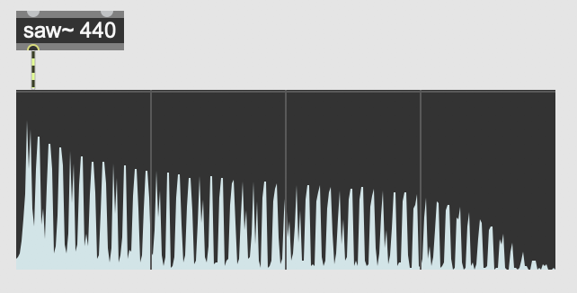
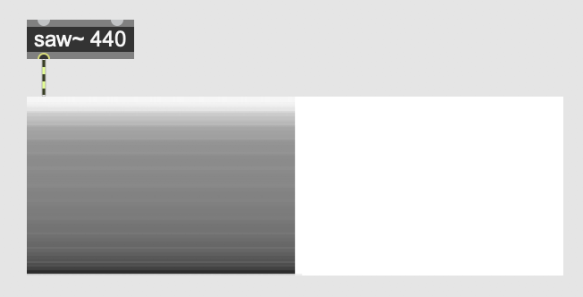
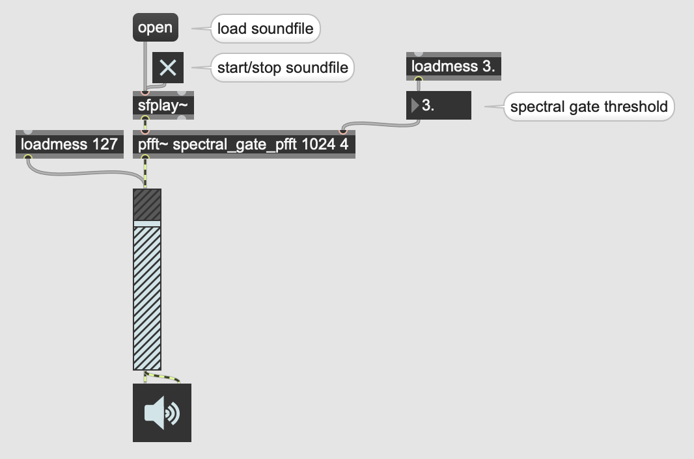

# Getting to the Frequency Domain: In Practice

How do we get from the time domain to the frequency domain in Max?  There are
two tutorials, [Using the
FFT](https://docs.cycling74.com/max7/tutorials/14_analysischapter03) and
[Signal Processing with
pfft~](https://docs.cycling74.com/max7/tutorials/14_analysischapter04), that
describe this process in great detail.  Please read these! The first
tutorial—Using the FFT—focuses mostly on the **fft~** object, which can
actually be a bit unwieldy and hard-to-use.  Therefore, focus more on the
second tutorial—Signal Processing with **pfft~**—which provides an easier way
to navigate some of these difficult concepts.

What follows here are some mini-tutorials, in an attempt to further simplify some of the material in the more wide-ranging tutorials linked above.

### Mini-Tutorial 1: Visualizing the Frequency Spectrum

Quick vocab review: when discussing timbre, and the relative strength of the
sine tones that compose a given pitch, we can refer to the totality of a
sound's frequency-to-magnitude mappings as its "spectrum".  Put more simply, do
you remember that visualization of the frequency domain, with frequency on the
x axis and magnitude on the y axis?  That's called a "spectrum".  In Max, we
can visualize a spectrum of a sound with the object **spectroscope~**.

<caption>The **spectroscope~** object, in "spectrogram" mode.</caption>

The **spectroscope~** object has two modes: spectrogram and sonogram.  The
spectrogram is what we've been discussing: a snapshot of magnitude over
frequency.  The sonogram is actually a map of frequency over time, with high
frequencies at the top of the y axis and low frequencies at the bottom of the y
axis.  Dark points represent louder frequencies, while lighter points represent
softer ones.

<caption>The **spectroscope~** object, in "sonogram" mode.</caption>

To switch between spectrogram and sonogram modes, change the "Display Mode"
attribute in the inspector window.

### Mini-Tutorial 2: How to Use pfft~

The **pfft~** object has a number of unusual quirks.  The first is that its
first argument is *the name of a Max patch*.  That's right: for **pfft~** to
work, you need to create completely separate, secondary Max patch that contains
all of the frequency-domain processing you want to do.  A common convention is
to postfix the filename of this secondary Max patch with "\_pfft" so that other
programmers understand what the patch is doing.  For example, you might have a
patch called "spectral_gate.maxpat", which contains the object **pfft~
spectral_gate_pfft.maxpat**.  So long as "spectral_gate_pfft.maxpat" is in same
folder or elsewhere on the search path, the **pfft~** will function correctly.

The second argument of **pfft~** is the FFT frame size.  Review the [previous
lession](1.getting-to-the-frequency-domain-theory.html) if you're unsure what this means.  To review, this must be a
power of 2, and the most common values are 1024, 2048, and 4096.

The third argument of **pfft~** is the *overlap factor*.  One way to counteract
the time-resolution/frequency-resolution tradeoff described in the previous
lession is to have FFT frames overlap with one another.  Usually this overlap
factor is fairly small, somewhere around 4.

That's it for **pfft~** arguments!  Now let's move on now to the interior Max
patch—the one that actually does the **pfft~** processing.

To change the number of inlets and outlets of **pfft~**, create **fftin~** and
**fftout~** objects.  These take one required argument: the (1-indexed) order
of inlet/outlet the object corresponds to on the outer-level.  So, if you want
to create a **pfft~** with two inlets and one outlet, create the objects
**fftin~ 1**, **fftin~ 2**, and **fftout~ 1**.

If you look at the three outlets of an **fftin~**, you'll see the leftmost is
labeled "Real Input", the middle is labeled "Imaginary Input", and the
rightmost is labeled "FFT Bin Index".  For the first two—real and
imaginary—these correspond to what are called the "cosine coefficient" and
"sine coefficient" of each frequency bin of the FFT.  Unless you really know
what you're doing, these coefficients will be of little use to you.  To get the
magnitude of each frequency bin—what you're probably really looking for—you
have to run *both* the real and imaginary inputs through a **cartopol~**
object.  Then, the left outlet of **cartopol~** will correspond to magnitude,
while the right outlet of **cartopol~** will correspond to phase.

When done playing around with magnitude and phase values, don't forgot to
run those values back through a **poltocar~** before passing them to
**fftout~**!

Finally, the "FFT Bin Index" outlet of **fftin~** tells you which bin the
corresponding cosine and sine coefficients belong to.  One quirk of this is
that this bin index only goes up to *half* the FFT size.  So, if your FFT size
is 4096, the FFT bin index will top out at 2047.  This is because the
frequencies from bins 2048 through 4095 will be above the Nyquist frequency,
and so are of no use for us.  To review what the Nyquist frequency is, reread
Prof. Dobrian's [Digital
Audio](http://music.arts.uci.edu/dobrian/digitalaudio.htm) article.

### Mini-Tutorial 3: Creating a Spectral Gate

Let's compose a cool audio effect that's only possible by translating to and
from the frequency domain: a "spectral gate".  Whereas a "noise gate" takes an
input signal, and only lets amplitude values pass through that are above a
given threshold, a spectral gate takes an input signal, and only lets
*frequency bins* pass through whose *magnitudes* are above a given threshold.
You can download this example below.

<caption>Outer-level spectral gate patch</caption>

<caption>View of "spectral_gate_pfft"</caption>

## Downloads

* [spectral_gate.zip](spectral_gate.zip)
