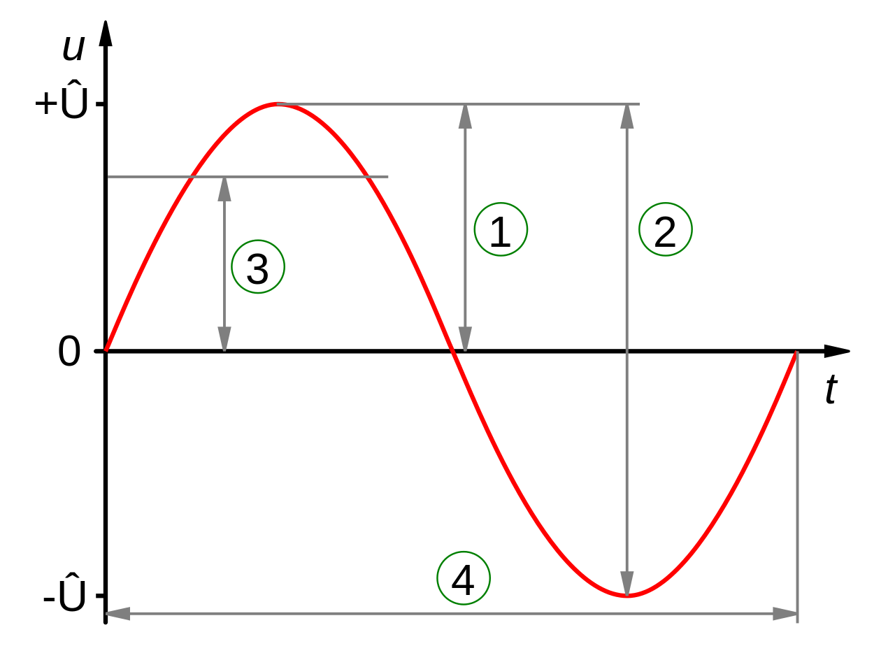

# Amplitude

In digital sound, amplitude is a measurement of the strength of a signal, usually between 0 and 1 (linearly) or between -infinity and 0 in decibels (dB). Colloquially, amplitude can be thought of as the volume of a sound (_not_ loudness), also called sound pressure level (SPL). Changing the amplitude of a sound is akin to turning a volume knob up or down on a car stereo.

### The decibel (dB)
Since our ear responds logarithmically to the amplitude of sound, amplitude (SPL) is most typically measured in decibels. A decibel is a unit of measurement that expresses the ratio of one quantity to another; that is, in order to express something in decibels, we need a reference value. Note the ratio in the logarithm of the equation for calculating the SPL of sound:

$$
  L_{p} = 20 \log_{10} \bigg(\frac{p_{rms}}{p_{ref}}\bigg) \text{ dB}
$$

### Peak v. RMS
When measuring the ammplitude of a signal, either the peak or root mean square (RMS) amplitude can be used. (Notice in the equation above that the numerator of the fraction is _prms_ which is the sound pressure level in root mean square (RMS) amplitude.)

In the graphic above, each number is the following:

  1. Peak amplitude (_Û_)
  2. Peak-to-peak amplitude (_2Û_)
  3. RMS amplitude (_Û/√2_)
  4. Period (not a measurement of amplitude)

In digital audio, we often use both peak and RMS amplitude. Peak-to-peak amplitude is almost never used since signals are typically centered around 0 (if you signal is not, there is a DC component that can be removed LINK TO RELEVANT FILE LATER).

## What if the peak amplitude exceeds 1?
If the peak amplitude exceeds 1, the result is distortion of the signal in the form of clipping. This can damage certain hardware and is best avoided.

If the level above 1 is known, one can simply multiply the signal by 1 minus that value.

More likely, however, whether or not the amplitude will exceed 1 is unknown. In this case there are several options: hard clipping. soft clipping, limiters, or compressors.
