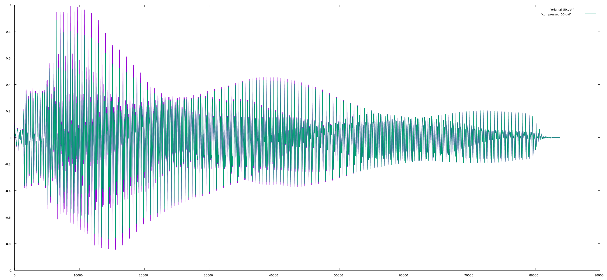

# Compression

Compression is a very common and useful signal processing device. By setting an amplitude threshold and a ratio, the dynamic range of a signal can be compressed into a smaller range. In audio, this is useful when a sound might push the boundaries of a DAC or when mixing to enable more control over the track in terms of its amplitude. The common attributes of a compressor are given below:

| __Parameter__ | __Description__ |
| -------------- | -------------- |
| Threshold | The level at which the compressor "kicks in". |
| Ratio | The ratio of compression. For example, 2:1 compression means that for every unit of amplitude the signal exceeds the threshold, it is diminished by a factor of two. |
| Attack Time | The time it takes for the compressor to reach full compression. This is useful since it avoids creating amplitude artifacts with quickly changing signals |
| Release Time |  Same as the above but for the time it takes the compressor to return to normal; i.e. no amplitude correction |
| Makeup Gain | The amount of gain to apply post-compression. |
| RMS Size | In an RMS compressor, the RMS size is often controllable. |


The basic form of a compressor is an envelope follower whose output is passed to a function that checks whether or not the amplitude has exceeded the threshold and if so, by what amount. If the amplitude exceeds the threshold, an amplitude correction is multiplied to the signal using the ratio. After compression is applied, the makeup gain is applied and the signal is sent out.

In the below example of an RMS compressor, the smoothing of the attack and release are accomplished with the use of a single-pole low pass filter. Without smoothing, amplitude artifacts would be introduced into the output. It is also assumed that one has an RMS function (`getRMS()`) elsewhere.

```
float gain = 0; // a placeholder
float diff = 0; // a placeholder

RMSCompressor(float *block, float *output, long samplesInBlock, float threshold = 0.707, float ratio = 2, float attTime = 0.003, float relTime = 0.03, float makeupGain = 0, int rmsSize = 64) {
  double attCoeff = 1 - exp(-1/(SAMPLERATE*attTime)); // the coefficient for the attack
  double relCoeff = 1 - exp(-1/(SAMPLERATE*relTime)); // the coefficient for the release
  float ratioFac = 1 - (1/ratio); // get the ratio factor
  float rmsBuff[] = rmsSize; // a buffer for RMS calculations

  for(sample = 0; sample < samplesPerBlock; sample++) {
    rmsAmp = getRMS(sample, rmsBuff); // get the RMS amplitude
    diff = (sample-threshold).clip(0,1); // get the difference

    if(diff>0) {
      // the signal exceeds the threshold. Apply compression using a single-pole low pass to smooth out the application.
      gain = gain + (attCoeff*((1-(diff*ratioFac))-gain));
    } {
      // else we need to return to normal; i.e. a gain of 1 (no correction)
      gain = gain + (relCoeff*(1-gain));
    };

    out = gain*sample*(1+makeupGain); // get the output
    *(output+sample) = out; // output
  };
}
```

When applied to a signal, the dynamic range is compressed. The image below is an overlay of an original signal (purple) and a compressed version (green) sampled at 44.1kHz. Note how the amplitude peaks on the compressed version are lower than the original. The following image shows the amplitude correction applied to the signal to create the compressed version. The compressor used was 5:1 with a threshold of 0.5, an attack time of 0.003, a release time of 0.03, and a makeup gain of 0.


More extreme compression with the threshold set to 0.2 and the ratio as 50:1.




And the same again but with the attack time set to 0.03 and the release time to 0.3.


#### The Limiter
A limiter is a type of compressor with certain settings such that it only makes itself known at the extreme ends of amplitude and in a very high degree. For instance, it might have a threshold of 0.9 linear amplitude and a ratio of 40.
