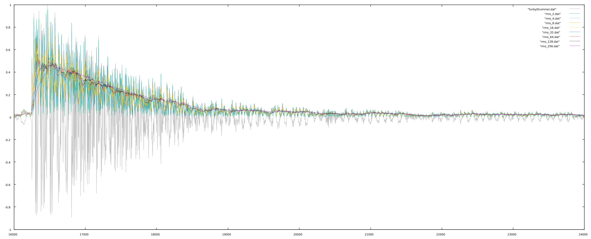

# Envelope Follower

Output should always be positive.

## Mean
One can use the mean of a signal to follow the envelope. Essentially, a buffer is allocated and filled with samples from the signal after rectification. Then the average of the buffer is taken to be the envelope. Naturally, the larger the buffer the smoother the output but more delayed (in time) the result.

```
float EF::GetMean(float sample)
{
  // wrap the index pointer
  if(envelopePosition >= envelopeArraySize)
    envelopePosition = 0;
	if(envelopePosition < 0)
    envelopePosition = 0;

  // FIRST: rectify the input
	if(sample < 0.0)
		sample = -1.0 * sample;

  // SECOND: add to array to calculate mean
  envelopeArrayTotal = envelopeArrayTotal - envelopeArray[envelopePosition] + sample;
  envelopeArray[envelopePosition] = sample;
  envelopePosition++;

  // THIRD: mean is total/arraysize
  return(envelopeArrayTotal/(float)envelopeArraySize);
}
```

All:


Zoomed:


## RMS

One can also calculate the RMS amplitude and use the result as an envelope follower. Similar to using the mean, the RMS method also uses a buffer, the size of which determines the smoothness and responsiveness of the envelope follower.

```
float EF::GetRMS(float sample)
{
  long meansquare;
  float square;
  if(envelopePosition >= compRMSArraySize)
    envelopePosition = 0;

  // FIRST: square the new sample
  // square range 0.0 to 1.0
  square = sample * sample;

  // SECOND: add to array to calculate mean
  envelopeArrayTotal = envelopeArrayTotal - envelopeArray[envelopePosition] + square;
  envelopeArray[envelopePosition] = square;
  envelopePosition++;

  // get the mean
	meansquare = envelopeArrayTotal/compRMSArraySize;

  // THIRD: meansquare needs to be scaled up to 65535 for root table lookup
  meansquare = (long)(envelopeArrayTotal * 65536.0);
	if(meansquare > 65535)
		meansquare = 65535;
    // FOURTH: return the root of the mean of squares
    return(sqrt(meansquare));
}
```
All:


Zoomed:


## Attack-Release

The attack-release method does not use a buffer but instead takes a moving weighted average of the peak amplitude and the sample. Here, though, one must pass the samplerate which, in part, governs the responsiveness of the follower.

```
float EF::GetPeakAttackRelase(float attackF, float releaseF, float sample)
{
	float attackMultiplier;
	float releaseMultiplier;

  // rectify
	if(sample < 0.0)
		sample = -sample;

  // filter
  attackMultiplier = exp((-6.283185307179586 * attackF)/samplerate);
  releaseMultiplier = exp((-6.283185307179586 * releaseF)/samplerate);

	if(sample > peak)
		peak = attackMultiplier * (peak - sample) + sample;
	else
		peak = releaseMultiplier * (peak - sample) + sample;
	return(peak);
}
```
All:


Zoomed:


## Envelope Followers Compared Aurally

Plotted below are three envelope followers: mean with a window of 16, RMS with a window of 16, and attack-release with cutoffs at 1000Hz (attack) and 5Hz (release). To test the envelope followers, we can pass noise through our resulting envelope. Here are the three enveloped plotted below.


[Original](./src/amplitude/envFollowers/funkyDrummer/78888__oasyntax__170-funky-drummer.mp3) <br/>
[Attack-Release (1000Hz and 5Hz)](./src/amplitude/envFollowers/funkyDrummer/attackRelease_1000-5.mp3)
