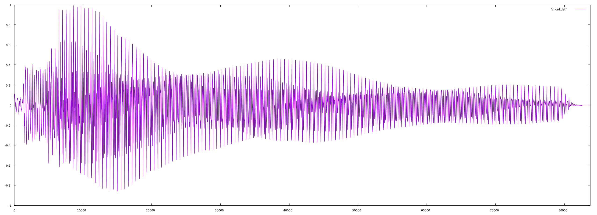
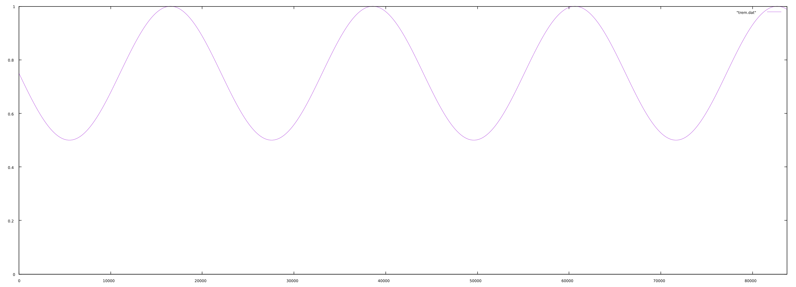
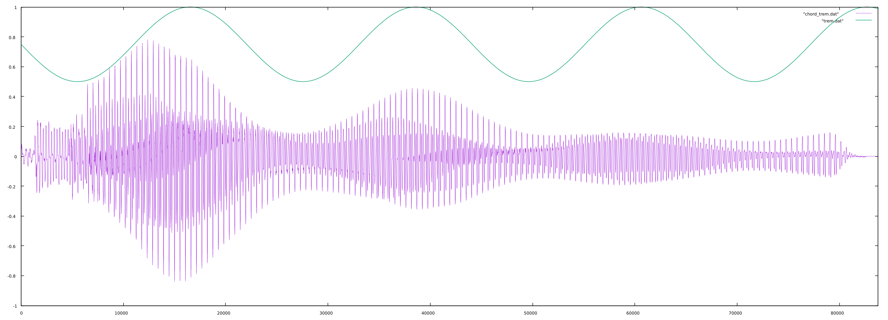

# Tremolo

In DSP, tremolo (not to be confused with vibrato) is a periodic amplitude variation of a signal. Most often, it appears in the form of a sine wave that _subtracts_ from the amplitude of the signal, though technically any waveform could be used. "Classic" tremolo can be charactarized as having two parts: speed and depth which are the frequency of the sine wave (modulator) and the degree to which it modifies the signal its being applied to (the modulators amplitude). It is, essentially, a very slow amplitude modulation.

## How It Works (there's got to be a better word for this...)

What needs to happen is to create a new signal such that if the depth of the tremolo is 0.5, the signal we multiply to the carrier oscillates between 1 and 0.5. If the depth is 0.25, then it must oscillate between 1 and 0.75, and so on.

The equation we follow is:

$$
  S_{m} = 1 - d \bigg{(} \frac{S_{sin}}{2} + 0.5 \bigg{)}
$$

Where:  
_Sm_ is the modulator (the signal that makes the tremolo effect)  
_Ssine_ is a sinewave input (oscillating between -1 and +1)  
_d_ is the depth of the tremolo between 0 and 1

This assumes that the frequency of the tremolo signal, _Ssine_, is set when generating that signal.

## Implementation

For the input signal (signal we want tremolo on), let's use a guitar chord:

<!-- __Input signal__   -->

[Listen](src/amplitude/tremolo/chord.mp3)

For a tremolo with a depth of 0.5 and a frequency of 2Hz, we get the following:

<!-- __Tremolo signal__   -->

When we multiply the input and the tremolo together, we get:

<!-- __Output with Tremolo Superimposed__   -->

[Listen](src/amplitude/tremolo/output.mp3)

In this plot, the tremolo signal and the output are superimposed to show the relationship.
