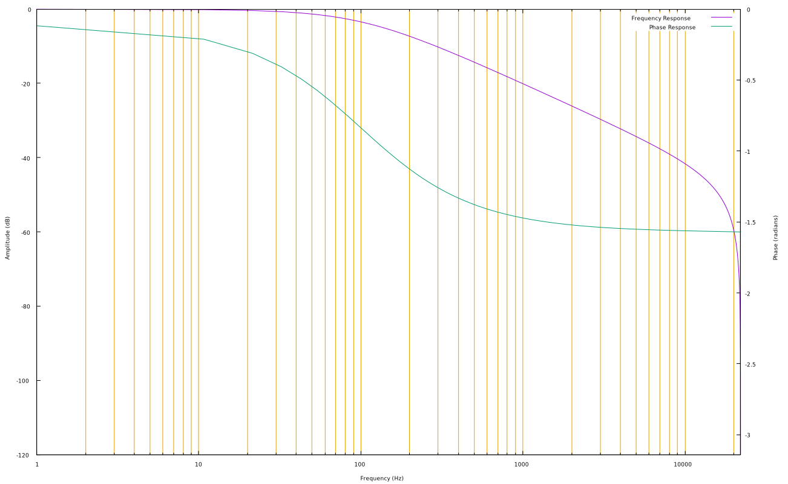

# Allpass

An allpass filter does just that: passes all frequencies (has a flat frequency response). What the fitler does, however, is change the phase relationship of the frequencies. This allows it to be a very flexible filter, useful in a number of implementations of lowpass, highpass, notch, and bandpass. It can also be used to create typical effects such as chorusing, flanging, and phasing.

The cutoff frequency in this case is the frequency at which the phase is pi/4 radians (90 degrees) out of phase with the input.

## First Order
A first order allpass is called such because it uses a one sample delay in its implementation.

$$
  y[n] = c(x[n]) + x[n-1] - c(y[n-1])
$$

where _c_ is the coefficent calculated from the tangent of the frequency, _tf_, _f<sub>c</sub>_ is the cutoff frequency, and _sr_ is the sampling rate:

$$
  t = tan\bigg(\pi \frac{f_c}{sr} \bigg)
$$

and _c_ is:
$$
  c = \frac{t-1}{t+1}
$$

```
float in1 = 0; // delayed sample
float out = 0; // keep track of the last output

FOAllPass(float *block, float *output, long samplesInBlock, float cutoff) {
  doube tf = tan(PI * (cutoff/SAMPLERATE)); // tangent frequency
  double coeff = (tf - 1.0)/(tf + 1.0); // coefficient

  for(sample = 0; sample < samplesPerBlock; sample++) {
    out = (coeff*sample) + in1 - (coeff * out); // get the output
    in1 = sample; // remember it
    *(output+sample) = out; // output
  };
}
```

The same can also be used in a first order lowpass/highpass by adding or subtracting the sample with its calculated output: <br/>

__Lowpass__
```
float in1 = 0; // delayed sample
float out = 0; // keep track of the last output

FOLowPass(float *block, float *output, long samplesInBlock, float cutoff) {
  doube tf = tan(PI * (cutoff/SAMPLERATE)); // tangent frequency
  double coeff = (tf - 1.0)/(tf + 1.0); // coefficient

  for(sample = 0; sample < samplesPerBlock; sample++) {
    out = (coeff*sample) + in1 - (coeff * out); // get the output
    in1 = sample; // remember it
    *(output+sample) = (sample+out)*0.5; // add to get lowpass and output
  };
}
```

At a cutoff of 100Hz, the output is as such:



__Highpass__
```
float in1 = 0; // delayed sample
float out = 0; // keep track of the last output

FOHighPass(float *block, float *output, long samplesInBlock, float cutoff) {
  doube tf = tan(PI * (cutoff/SAMPLERATE)); // tangent frequency
  double coeff = (tf - 1.0)/(tf + 1.0); // coefficient

  for(sample = 0; sample < samplesPerBlock; sample++) {
    out = (coeff*sample) + in1 - (coeff * out); // get the output
    in1 = sample; // remember it
    *(output+sample) = (sample-out)*0.5; // add to get highpass and output
  };
}
```
