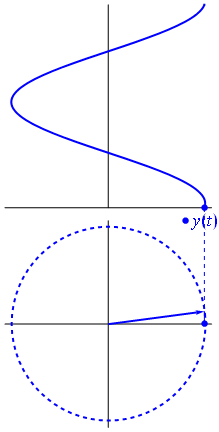
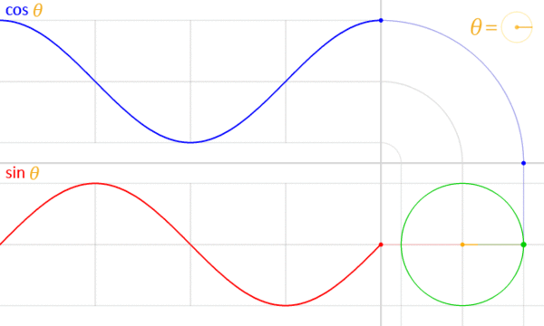
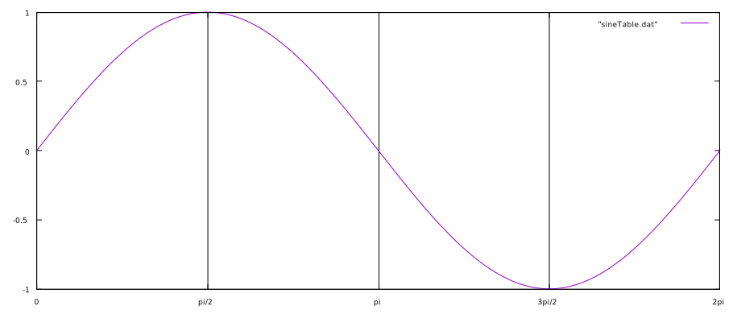

# Complex Sinusoids

Complex sinusoids are two-dimensional signals whose value at any instant can be specified by a complex number; that is, a number with  _real_ part and an _imaginary_ part. These two parts are in what is known as _phase quadrature_ with one another; i.e. the imaginary part is pi/2 radians out of phase with the real part (1/4 of a cycle). That is why the components of the complex signal are sometimes known as _in-phase_ and _quadrature phase_.

A complex sinusoid is defined by the following mathematical representations:

Cartesian Form:
$$
  x(t) \triangleq Acos(\omega t + \phi) + jAsin(\omega t + \phi)
$$

Polar Form:
$$
  x(t) = Ae^{j(\omega t + \phi)}
$$

where _A_ is amplitude, _ω_ is the angular frequency in radians per second (the frequency in Hertz scaled by 2π; _2πf_), _ϕ_ is the initial phase offset in radians, and _t_ is time in seconds. The cosine portion of the sinusoid is the real component and the sine portion is the imaginary (phase quadrature) component. (In engineering, the variable _j_ is typically denoted to mean the square root of negative 1, whereas pure math often uses the variable _i_ to mean the same thing).

## Projection

Recall the Pythagorean Identity:

$$
  cos^2(\phi) + sin^2(\phi) = 1
$$

Reconfiguring the Cartesian form of a complex sinusoid with this in mind, we get:

$$
  |x(t)| \triangleq \sqrt{re^2\{x(t)\} + im\{x(t)\}} \equiv A
$$

In other words, a complex sinusoid has a constant complex magnitude (_A_). Since this is true, the projection of a complex signal (in complex form) onto the complex plane must lie on a circle; i.e. the radius (magnitude) remains the same while the angle changes). Recall the animation in the beginning of this section:

This animation shows the counter-clockwise motion of the real (cosine) component of the complex sinusoid projected onto the complex plane. We can also project the complex phasor onto orthogonal axes:

The green circle in the bottom right corner is the [unit circle](https://en.wikipedia.org/wiki/Unit_circle) in the complex plane. We can rewrite the trigonometric form of the equation into polar form:

$$
  cos\theta + jsin\theta = re^{j\theta}
$$

where _j_ is the square root of negative 1, _r_ is the length (or magnitude), _θ_ is the angle in radians, and _e_ is Euler's number.

Relabeling a sine wave:

## Advantages
Represeting a sinewave in complex form has several distinct advantages:

Instantaneous Frequency:

$$
  f = \omega + \frac{d}{dt}\phi(t)
$$

Instantaneous Phase:

$$
  \angle x(t) = \omega t + \phi
$$

Instantaneous Magnitude (Amplitude):

$$
  A = \sqrt{re^2\{x(t)\} + im\{x(t)\}}
$$
