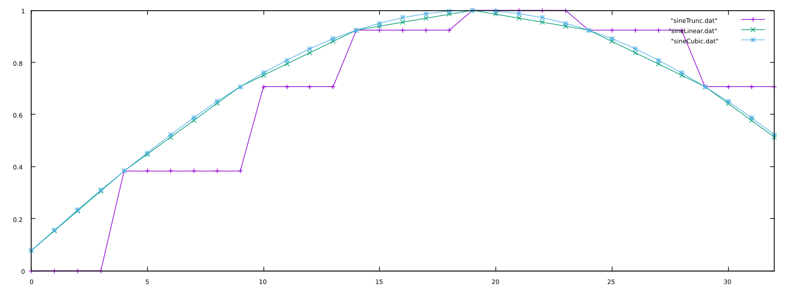

## Interpolation

When we use phase truncation on a phasor whose frequency is low relative the tablesize and sampling rate, consecutive samples may not change. To counter this, we can use different methods of interpolation to more accurately represent the waveforms when the periods of the phasor are very small compared to the size of the table.

It is essentially the ratio between the period of the phasor and size of the table...

### Linear Interpolation

Linear interpolation involves using the fractional part of the calculated phase to calculate the "distance" between the two points on which we lie. If, for instance, our calculated index is 32.76, we would need to look at _both_ indexes 32 and 33. We would then take their respective values, `t[32]` and `t[33]`, calculate the difference between the latter index and the earlier, multiply by the fractional part, then add it to the index as we would in phase truncation:

```
frac = index - int(index); // calculate the fractional part

// get the difference and wrap the index (can also use a modulo)
while(
  {index > tablesize},
  {
    index = index-tablesize;
  }
);
if (index == tablesize-1) {
  diff = t[0] - t[index]; // wrap
} else {
  diff = t[index+1] - t[index]; // no need to wrap
};

// get the interpolated output
out = t[index]+(diff*frac);
```

where `t` is the table filled with the sine wave and `index` is the calculated index with a phasor multiplied by the size of the table minus 1.


### Hermite (Cubic) Interpolation

A more accurate interpolation technique is the Hermite or cubic method. What this method essentially does is to find the coefficients _a_, _b_, _c_, and _d_ for the third degree polynomial _f(x)_ and its derivative, _f'(x)_, at _x = 0_ and _x = 1_.

$$
\begin{align}
& f(x) = ax^3 + bx^2 + cx + d
\\
& f'(x) = 3ax^2 + 2bx + c
\end{align}
$$

#### Calculating the Coefficients

Given four points, (_x<sub>0</sub>_,_y<sub>0</sub>_), (_x<sub>1</sub>_,_y<sub>1</sub>_), (_x<sub>2</sub>_,_y<sub>2</sub>_), (_x<sub>3</sub>_,_y<sub>3</sub>_), we can calculate the coefficients with the following:

$$
\begin{align}
  & a = -\frac{y_{0}}{2} + \frac{3y_{1}}{2} - \frac{3y_{2}}{2} + \frac{y_{3}}{2}
  \\
  & b = y_{0} - \frac{5y_{1}}{2} + 2y_{2} - \frac{y_{3}}{2}
  \\
  & c = -\frac{y_{0}}{2} + \frac{y_{2}}{2}
  \\
  & d = y_{1}
\end{align}
$$
This is called the Catmull-Rom spline.

Calculating these coefficients and plugging them into the third degree polynomial (the first equation) gives us the cubic interpolative values between _x = 0_ and _x = 1_.

#### Putting it Together

Given an index _i_, we need to get the indices _i-1_, _i_, _i+1_, and _i+2_ to use them in our cubic interpolator.

```
float cubicInterpolator(float idx, float *table)
{
  long trunc = (long) idx; // truncate the index but don't overwrite
  float frac = idx - trunc; // get the fractional part

  // get the indicies
  int x0 = wrap(trunc-1, tableSize-1);
  int x1 = wrap(trunc, tableSize-1);
  int x2 = wrap(trunc+1, tableSize-1);
  int x3 = wrap(trunc+2, tableSize-1);

  // calculate the coefficients
  float a = -0.5*table[x0] + 1.5*table[x1] - 1.5*table[x2] + 0.5*table[x3];
  float b = table[x0] - 2.5*table[x1] + 2*table[x2] - 0.5*table[x3];
  float c = -0.5*table[x0] + 0.5*table[x2];
  float d = table[x1];

  return a*(frac**3) + b*(frac**2) + c*frac + d;
}

```


#### Phase Truncation, Linear Interpolation, and Cubic Interpolation Compared

If we push this to an extreme to show the differences, this plot shows samples 32 to 64 of the same 100Hz sine wave lookup sampled at 8kHz using either phase truncation (purple), linear interpolation (green), or cubic interpolation (blue) from a tablesize of 16:



#### Listen
Listen to each of the different interpolation methods below. Be particularly aware of the differences at extremely high and low frequencies.

[Phase Truncation](src/lookupTable/sineTruncPlay.html) <br/>
[Linear Interpolation](src/lookupTable/sinePlay.html)<br/>
[Cubic Interpolation](src/lookupTable/sineCubicPlay.html)
