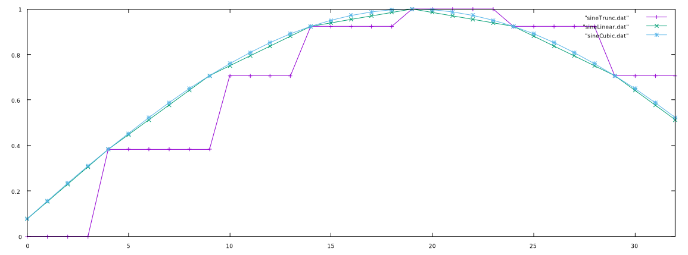

# Table Lookup Oscillators

Often it is much more efficient to create a waveform using a lookup table as opposed to calculating the output directly. This is most often the case with the most acoustically simple waveform, the sine wave. One can calculate a sine wave from a phasor by multiplying the phasor by 2π, the number of radians in a circle, such that the phasor now extends from 0 to 2π. That value is then used in a sine operation such that the final equation looks like this:

$$
  f(x) = sin(\phi2\pi)
$$

or:

```
sin(phasor(f)*2*PI)
```

where `PI` is the value of π and `f` is the frequency in Hz of the waveform. This, however, means that the sine of the phasor is calculated for every sample. On the other hand, if we populate a table with a single cycle of a precomputed sine wave, all that needs to be done is to index into the table at the rate of the frequency of the sine wave desired.

```
static double 2PI = 3.14159 * 2; // two pi
int tablesize = 1024; // size of the table
double sinetable[] = tablesize; // allocate a table

// fill the table
for(int i = 0; i < tablesize; i++) {
  sinetable[i] = sin((2PI*i)/tablesize);
}
```

Using a tablesize of 1024, the table looks like this:


To index into this table, we need to use integers. If we take a phasor at some desired frequency, we can take the output and multiply it by the _size of the table minus one_ (since in most languages we start counting from 0) and cut off the fractional part to obtain an index:

$$
  i = \lfloor \phi * s \rfloor
$$

where _s_ is the size of the table and phi is the value of the phasor from 0 to 1. In code:

```
index = int(phasor(f)*tablesize)
```

This method of simply removing the fractional part of the phase is called _phase truncation_. We can then use this output to index into the table and get the correct value for the sine wave. Below are the first 512 samples of a 100Hz phasor indexing into a wavetable of size 1024 at an 8kHz samplerate:


## Interpolation

When we use phase truncation on a phasor whose frequency is low relative the tablesize and sampling rate, consecutive samples may not change. To counter this, we can use different methods of interpolation to more accurately represent the waveforms when the periods of the phasor are very small compared to the size of the table.

It is essentially the ratio between the period of the phasor and size of the table...

### Linear Interpolation

Linear interpolation involves using the fractional part of the calculated phase to calculate the "distance" between the two points on which we lie. If, for instance, our calculated index is 32.76, we would need to look at _both_ indexes 32 and 33. We would then take their respective values, `t[32]` and `t[33]`, calculate the difference between the latter index and the earlier, multiply by the fractional part, then add it to the index as we would in phase truncation:

```
frac = index - int(index); // calculate the fractional part

// get the difference and wrap the index (can also use a modulo)
while(
  {index > tablesize},
  {
    index = index-tablesize;
  }
);
if (index == tablesize-1) {
  diff = t[0] - t[index]; // wrap
} else {
  diff = t[index+1] - t[index]; // no need to wrap
};

// get the interpolated output
out = t[index]+(diff*frac);
```

where `t` is the table filled with the sine wave and `index` is the calculated index with a phasor multiplied by the size of the table minus 1.


### Hermite (Cubic) Interpolation

A more accurate interpolation technique is the Hermite or cubic method. What this method essentially does is to find the coefficients _a_, _b_, _c_, and _d_ for the third degree polynomial _f(x)_ and its derivative, _f'(x)_, at _x = 0_ and _x = 1_.

$$
\begin{align}
& f(x) = ax^3 + bx^2 + cx + d
\\
& f'(x) = 3ax^2 + 2bx + c
\end{align}
$$

#### Calculating the Coefficients

Calculating the results of the above equations for _x = 0_ and _x = 1_:

$$
\begin{align}
  &f(0) = d
  \\
  &f(1) = a + b + c + d
  \\
  &f'(0) = c
  \\
  &f'(1) = 3a + 2b + c
\end{align}
$$

Then, the equations can be rewritten as such to find the coefficients:

$$
\begin{align}
  & a = 2f(0) = 2f(1) + f'(0) + f'(1)
  \\
  & b = -3f(0) + 3f(1) - 2f'(0) - f'(1)
  \\
  & c = f'(0)
  \\
  & d = f(0)
\end{align}
$$

When we use a list of values of an arbitary length, we don't necesarily know the derivative of the entire function. In that case, we use the slope of a line between the previous point and the next point; this is called the Catmull-Rom spline. Supposing we have values _y0_, _y1_, _y2_, and _y3_ at _x = -1, 0, 1, 2_ respectively, we can assign the values of _f(0)_, _f(1)_, _f'(0)_ and _f'(1)_ using the following formulas:

$$
\begin{align}
  &f(0) = y_{1}
  \\
  &f(1) = y_{2}
  \\
  &f'(0) = \frac{y_{2} + y_{0}}{2}
  \\
  &f'(1) = \frac{y_{3} + y_{1}}{2}
\end{align}
$$

If we combine these with the formulas for the coefficients, we get the following:

$$
\begin{align}
  & a = -\frac{y_{0}}{2} + \frac{3y_{1}}{2} - \frac{3y_{2}}{2} + \frac{y_{3}}{2}
  \\
  & b = y_{0} - \frac{5y_{1}}{2} + 2y_{2} - \frac{y_{3}}{2}
  \\
  & c = -\frac{y_{0}}{2} + \frac{y_{2}}{2}
  \\
  & d = y_{1}
\end{align}
$$

Calculating these coefficients and plugging them into the third degree polynomial (the first equation) gives us the cubic interpolative values between _x = 0_ and _x = 1_.

#### Putting it Together

Given an index _i_, we need to calculate the indices _i-1_, _i_, _i+1_, and _i+2_ to use them in our cubic interpolator.

WRITE MORE DOWN HERE


#### Phase Truncation, Linear Interpolation, and Cubic Interpolation Compared

If we push this to an extreme to show the differences, this plot shows the first 32 samples of the same 100Hz sine wave lookup sampled at 8kHz using either phase truncation (purple), linear interpolation (green), or cubic interpolation (blue) from a tablesize of 16:


