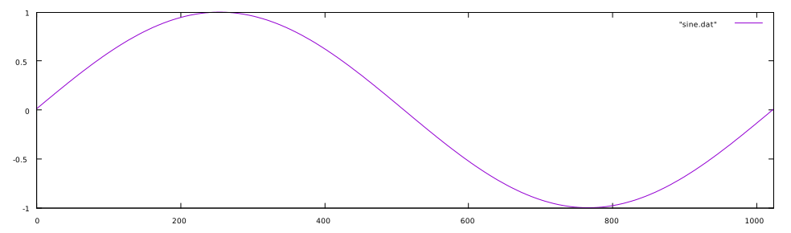
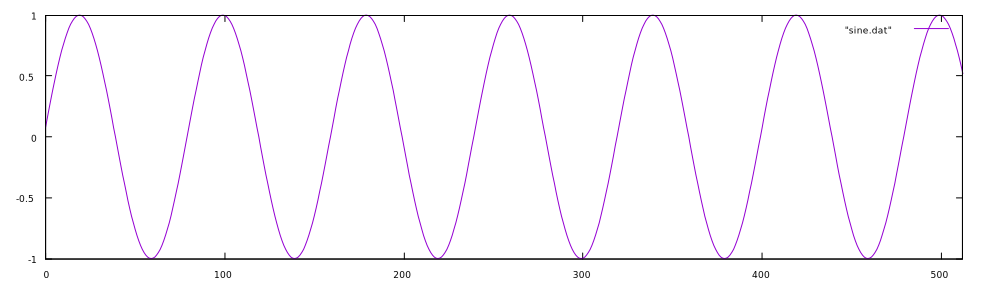

# Table Lookup Oscillators

Often it is much more efficient to create a waveform using a lookup table as opposed to calculating the output directly. This is most often the case with the most acoustically simple waveform, the sine wave. One can calculate a sine wave from a phasor by multiplying the phasor by 2π, the number of radians in a circle, such that the phasor now extends from 0 to 2π. That value is then used in a sine operation such that the final equation looks like this:

$$
  f(x) = sin(\phi2\pi)
$$

or:

```
sin(phasor(f)*2*PI)
```

where `PI` is the value of π and `f` is the frequency in Hz of the waveform. This, however, means that the sine of the phasor is calculated for every sample. On the other hand, if we populate a table with a single cycle of a precomputed sine wave, all that needs to be done is to index into the table at the rate of the frequency of the sine wave desired.

```
static double 2PI = 3.14159 * 2; // two pi
int tablesize = 1024; // size of the table
double sinetable[] = tablesize; // allocate a table

// fill the table
for(int i = 0; i < tablesize; i++) {
  sinetable[i] = sin((2PI*i)/tablesize);
}
```

Using a tablesize of 1024, the table looks like this:



To index into this table, we need to use integers. If we take a phasor at some desired frequency, we can take the output and multiply it by the _size of the table minus one_ (since in most languages we start counting from 0) and cut off the fractional part to obtain an index:

$$
  i = \lfloor \phi * s \rfloor
$$

where _s_ is the size of the table and phi is the value of the phasor from 0 to 1. In code:

```
index = int(phasor(f)*tablesize)
```

This method of simply removing the fractional part of the phase is called _phase truncation_. We can then use this output to index into the table and get the correct value for the sine wave. Below are the first 512 samples of a 100Hz phasor indexing into a wavetable of size 1024 at an 8kHz samplerate:


