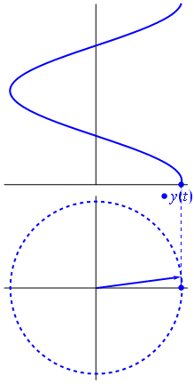

# Oscillators

The most basic sound-generating process in digital sound is the oscillator which is defined as BLAH BLAH.

## As a concept

### Unit Circle
A helpful analogy of the oscillator is that of the wheel and spoke.

The angle of the "spoke" is the phase at a given moment in time while the frequency is the change in phase per unit of time. The length (magnitude) of the spoke is the amplitude at any given point.

### Phase
The phase of a waveform, often denoted with the Greek letter phi (Φ), is a means to define a specifc point on a waveform. In the analogy above, the unit circle contains 2pi radians around the circumference and thus, one rotation contains 2pi radians of phase.
