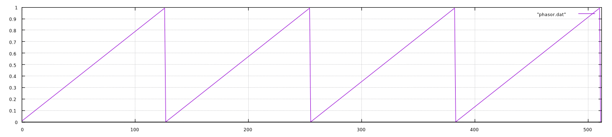
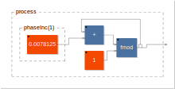

# The Phasor

The phasor is perhaps the most simple and fundamental of oscillators. It takes the shape of a [sawtooth wave](link/to/sawtooth) but has two important differences:

  1. It ascends from 0 to 1, as opposed from -1 to +1.
  2. It is _not_ bandlimited (in discrete time this matters).

$$
  x_{phasor}(t) = \frac{t}{p} \text{mod } 1
$$

where _p_ is the period in Hertz and _t_ is time.

```
sampleRate = 128; // the samplerate in Hz
freq = 1; // the frequency in Hz
phasePerSecond = freq; // the change in phase per unit of time; i.e. the frequency when time is seconds
phasePerSample = freq/sampleRate; // the amount of change in phase per sample for a given frequency at a given samplerate

Osc::Osc()
{
  phase = 0.0;
  phaseIncrement = 0.0;
}

void Osc::Phasor(float *frequency, float *output, long samplesPerBlock)
{
  long sample;

  // calculate for each sample in a block
  for(sample = 0; sample<samplesPerBlock; sample++)
  {
    phaseIncrement = *(frequency + sample)/sampleRate; // get the phase increment for this sample
    *(output+sample) = phase; // calculate the output for this sample
    phase = phase + phaseIncrement; // increment the phase
  }
}
```
Important here is the relationship between `phasePerSample` and `freq`: they are, in fact, representations of the same thing. With frequency, we give the total number of rotations (oscillations) in a second while phase per sample is the rate of change at the sampling period. If we want to give an oscillator a frequency, we will need to calculate the change in phase per sample; i.e. `phasePerSample`.

Using a samplerate of 128Hz, the first 512 samples of a 1Hz phasor are plotted below:



Notice how the waveform ascends from 0 to 1 as noted above. This makes it extraordinarily useful in waveshaping, indexing into tables, etc. As a simplified block diagram, the phasor looks like this:



`phaseInc(1)` is the phase increment for a 1Hz signal at a 128Hz samplerate. 1/128 = 0.0078125.
