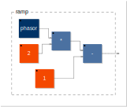
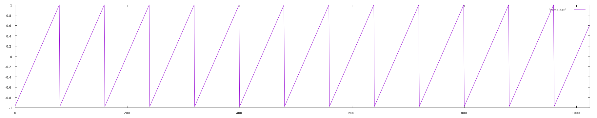

# Ramp

A ramp wave is essentially a phasor that goes from -1 to +1. The methods here will produce a non-bandlimited ramp.

### Using algebra

Using the phasor as the starting point, it is fairly straightforward to create a ramp algebraically:

That is, take the phasor, multiply it by two and subtract one. This results in a ramp that ascends from -1 to +1. Or: `(phasor*2)-1`. This results in the following waveform, the first 512 samples of a 100Hz ramp at a samplerate of 8kHz:

