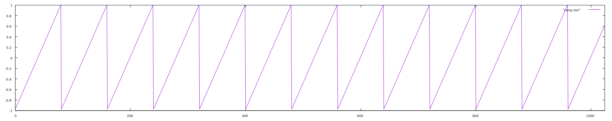
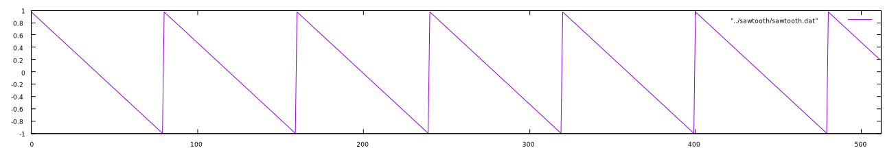

# Ramp and Sawtooth

The ramp wave and a sawtooth wave are mirror images of one another. The ramp ascends linearly from -1 to +1 while the sawtooth descends linearly from +1 to -1. The methods here will produce a non-bandlimited waveforms.

## Ramp

A ramp wave is essentially a phasor that goes from -1 to +1.

$$
  x_{ramp}(t) = 2 \bigg( \frac{t}{p} \text{mod } 1 \bigg) - 1
$$

### Using algebra

Using the phasor as the starting point, it is fairly straightforward to create a ramp algebraically:

That is, take the phasor, multiply it by two and subtract one. This results in a ramp that ascends from -1 to +1. Or: `(phasor*2)-1`. This results in the following waveform, the first 512 samples of a 100Hz ramp at a samplerate of 8kHz:

## Sawtooth

A sawtooth wave is ramp that _descends_ from +1 to -1.

### Using algebra

Using the phasor as the starting point, it is fairly straightforward to create a ramp algebraically:

$$
  x_{sawtooth}(t) = -2 \bigg( \frac{t}{p} \text{mod } 1 \bigg) + 1
$$

That is, take the phasor, multiply it by two and subtract one. This results in a sawtooth wave that descends from +1 to -1. Or: `(phasor * -2) + 1`. This results in the following waveform, the first 512 samples of a 100Hz sawtooth at a samplerate of 8kHz:

