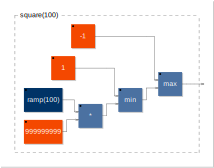
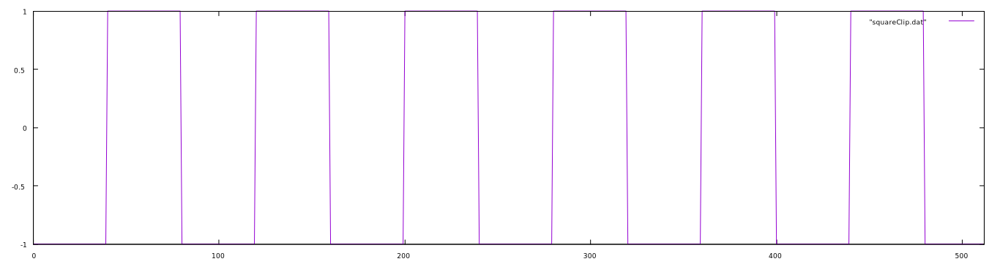

# Square and Triangle

Two other simple waveforms, the square and triangle, can also be created with the phasor as input.

## Square

The square wave is just that: a waveform that resembles a square. It is a special case of the pulse wave, which we will see later, where the duty cycle (the ratio between the high and low points) is 50%. It can be created algebraically or via logic operations.

### Using algebra

_Caveat: this method resembled the engineering technique BFI more than a clean algebraic method._

One method of this is to create a ramp or sawtooth, multiply it by some very high number, and clip it at -1 and +1: `(ramp*9999999).clip(-1,1)`.

```
// make a clip function
float clip(float n, float lower, float upper) {
  return std::max(lower, std::min(n, upper));
}

void Osc::Square(float *frequency, float *output, long samplesPerBlock)
{
  long sample;
  float rampPhase;

  // calculate for each sample in a block
  for(sample = 0; sample<samplesPerBlock; sample++)
  {
    phaseIncrement = *(frequency + sample)/sampleRate; // get the phase increment for this sample
    rampPhase = (phase*2)-1; // make a ramp (-1 to +1)
    *(output+sample) = clip(ramp*9999999999, -1, 1); // get the output for this sample
    phase = phase + phaseIncrement; // increment the phase
  }
}
```



#### Counting samples

One can also count the number of samples in a period. That is, if we know our sample rate is 1000Hz and we want a square wave at a frequency of 50Hz, we know that a complete period of the square wave will be 1000/50 or `samplerate/frequency`. This means that a 50Hz square wave (or any waveform, for that matter) at a 1000Hz sample rate is going to have a period of 20 samples. Since we know that a square wave's duty cycle is 50%, we know that the wave will be +1 for 10 samples, then -1 for 10 samples.

__NOTE: This is related to BLIP and BLEP__

### Using logic

Perhaps a bit cleaner is to use logical operations on a ramp: `square = sign(ramp);`

```
void Osc::Square(float *frequency, float *output, long samplesPerBlock)
{
  long sample;
  float rampPhase;

  // calculate for each sample in a block
  for(sample = 0; sample<samplesPerBlock; sample++)
  {
    phaseIncrement = *(frequency + sample)/sampleRate; // get the phase increment for this sample
    rampPhase = (phase*2)-1; // make a ramp (-1 to +1)
    *(output+sample) = copysign(1, rampPhase); // get the output fot this sample
    phase = phase + phaseIncrement; // increment the phase
  }
}
```

Or on a phasor:

```
void Osc::Square(float *frequency, float *output, long samplesPerBlock)
{
  long sample;

  // calculate for each sample in a block
  for(sample = 0; sample<samplesPerBlock; sample++)
  {
    phaseIncrement = *(frequency + sample)/sampleRate; // get the phase increment for this sample
    // calculate the output for this sample
    if(phase <= 0) {
      *(output+sample) = -1;
    } else {
      *(output+sample) = 1;
    };
    phase = phase + phaseIncrement; // increment the phase
  }
}
```

Whatever method is used, the result looks something like this:


